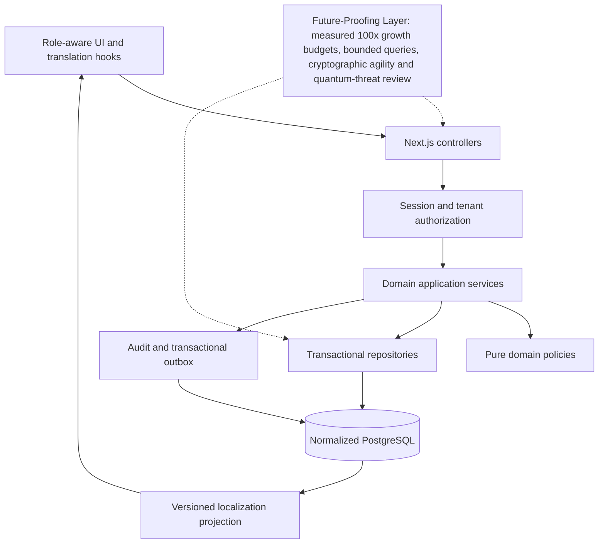

# Enterprise HRMS implementation blueprint

Date: 2026-09-13. Baseline: `04520f5`. This is an implementation and evidence register, not a production-readiness declaration. The current user request explicitly authorizes beginning backend/database work; earlier UI-only restrictions no longer prohibit this migration. Production data and deployment cutover still require verified migration and isolation evidence.

## Phase order and acceptance

| Phase | Acceptance gate | Current evidence |
| --- | --- | --- |
| 0 | Clean Git baseline before edits | Clean `04520f5`; no baseline commit needed |
| 1 | Feature Catalog opens and navigates; compiler passes | Missing `useState`/`readData` imports fixed; catalog converted to TypeScript; regression passed in desktop and touch browser profiles; isolated local production build passed |
| 2 | Source inventory and explicit domain gaps | Generated [inventory](plan/enterprise-inventory.json); this blueprint |
| 3 | Ordered migrations, explicit domain columns, FKs, constraints and verified database | In progress; no connection was configured at discovery |
| 4 | Database-driven localization and authenticated live domain workflows | Pending migration gates; current workspace still uses synthetic snapshots |
| 5 | Lint, unit/integration/browser tests and real connection/isolation proof | Phase 1 checks passed; full migration acceptance remains open |

## Source-verified architecture

There are 8 page entrypoints, 185 route handlers, 73 component source files, 29 `src/server/*/service.ts` files, 102 navigation entries, and 74 UI JSON resources containing 17,151 string values. Counts are reproducible with `node scripts/discover-enterprise.mjs`. The inventory lists every discovered page, component, service, menu destination and declared schema table. Counts describe source presence, not operational completeness.

The current `/workspace` mounts `AppWorkspace`, `HRMSContext`, `AuthContext` and views selected by `MainWorkspace`. Navigation uses a catalog and in-workspace state rather than separate URLs for each module. Feature Catalog failed on render because its React hook and data-reader imports were absent; changing Next router patterns would not fix that failure.

`/api/workspace-data` currently serves a synthetic snapshot under a demo toggle. The preview login does not establish a persistent production session. Existing `/api/v1` handlers independently use Better Auth, tenant context, permission enforcement and SQL services. The presence of those handlers does not connect the current React preview to them.

Existing canonical metadata declares 304 logical tables and 947 relationships. This is not proof of 3NF, correct cardinalities or live referential integrity. The Drizzle migration journal omits SQL files 0013–0015. Retired Prisma assets coexist with the active Drizzle path; do not run both migration engines against the same database. Historical documents claiming all copied APIs are operational are superseded by source and executable evidence in this plan.

## Target: Clean Architecture with domain boundaries

- **Controllers:** `src/app/api/v1` parses request envelopes, validates transport input and resolves authenticated tenant context. Controllers contain no payroll formulas or fixture fallback.
- **Application services:** `src/server/<domain>/service.ts` coordinates authorization, transaction boundaries, concurrency checks, auditing and outbox events.
- **Domain layer:** pure policies, state machines and calculation functions under each domain; explicit inputs, deterministic outputs, integer minor units for money. Extract existing policies incrementally rather than duplicating them in a second framework.
- **Data access:** repositories own parameterized SQL, projections, pagination and transaction scoping. ORM/table definitions and migration ownership remain in `src/lib/db` and `db/migrations`.
- **Frontend adapters:** `src/services` and `src/lib/client-api.ts` own asynchronous transport. Hooks handle loading, error, cancellation, cache invalidation and optimistic concurrency. Components consume typed domain DTOs and translation keys, never SQL or synthetic fallback records.
- **Localization:** relational locale/namespace/message/translation tables, versioned read API and React translation provider. Never publish personnel records, emails, internal IDs or permissions as public translations.
- **Configuration:** typed configuration definitions and explicit scoped values. Secrets remain in the environment/secret manager; connection bootstrap cannot depend on the database it is configuring.

## Current UI mapping and enterprise gaps

The complete 102-entry parent/group/item/target mapping is in `plan/enterprise-inventory.json`. Rendering a generic operational queue is classified as a prototype until its domain-specific mutation is verified.

| Domain | Present UI/workflows | Existing server foundation | Required completion and proof |
| --- | --- | --- | --- |
| Identity/platform | Login, five preview roles, access control, settings, governance | identity, platform/admin, Better Auth, roles and membership permissions | Persistent-session frontend, server-filtered menus/data, MFA, privilege escalation tests, tenant switching and revocation |
| People/organization | People Core, directory, positions, assignments, documents, team history | organization, people routes | Typed profile/assignment DTOs, effective dating, field-level privacy, employee/team scoping, validated import preview/apply |
| Attendance | Punches, schedules, rosters, regularizations, shift swaps | attendance service and policies | Real clock inputs, timezone/DST boundaries, duplicate/idempotent punches, concurrent approval and manager hierarchy checks |
| Leave | Requests, balances, ledger, policies, comp-off | leave service and ledger rules | Persistent request/approval transitions, atomic ledger updates, cancellation/reversal, concurrent balance and policy-version tests |
| Payroll/finance | Payroll control room, components, advances, loans, statutory previews | payroll, loans, advances, fx | Replace hardcoded salary/component/tax scaffolding; normalized effective-dated payroll profiles, reproducible input snapshots, approval separation, locked run corrections, jurisdiction-specific reviewed rules |
| Talent/lifecycle | Recruitment, requisitions, interviews, onboarding, clearance, assets | talent, interviews, lifecycle | Typed pipelines/checklists, stage permissions, duplicate candidates, attachment handling and end-to-end hire/exit transactions |
| Performance/development | Goals, cycles, feedback, calibration, skills, learning | performance, skills, learning | Participant privacy, rating scales, locks/reopens, versioned rubrics, evidence review and completion proofs |
| Compensation/benefits | Bands, proposals, budget cycles, benefit claims/enrollments | compensation, benefits | Effective-date and currency integrity, approval limits, budget locking and contribution calculations |
| Experience/support | Surveys, recognition, announcements, helpdesk, projects | engagement, notifications, ops | Service-backed inboxes and tasks, scoped surveys, delivery failures, SLAs and linked support workflows |
| Contingent workforce | Agencies, contracts, invoices, gate passes | contractors | Contract validity, worker identity, invoice matching and assignment authorization |
| Analytics/AI | Analytics, capability and intelligence consoles | analytics, ai, vp | Real scoped aggregates, metric definitions, provenance, explainability and governed AI actions; no invented predictions |
| Compliance/privacy | Statutory previews, evidence, privacy requests, retention | compliance, privacy, exports | Jurisdiction input, retention/hold rules, auditable exports, evidence validation; no legal compliance claims from demo formulas |
| Integrations/operations | Integration catalog, connections, import/export and jobs | integrations, exports, outbox/job tables | Credential isolation, retry/dead-letter behavior, webhook verification, idempotency and audited connector activation |
| Localization/configuration | English JSON labels, four appearance palettes | No localization schema/engine found | Classify all string values; import translatable labels into relational tables; replace inline labels with keys; locale fallback/version/cache tests; configuration values separated from secrets |
| Audit/security | Access-control and governance UI | `recordAudit`, tenant transactions and audit_events | Audit writes atomic with mutations, append-only application grants, before/after redaction, actor/tenant/request correlation and denial tests |

## Normalization and migration rules

1. Preserve existing identities and tenant keys. Every tenant-owned child needs an enforced tenant-consistent FK or an independently verified equivalent constraint. Unique business keys include tenant scope.
2. Replace business `attributes` JSON with explicit columns and associative tables domain by domain. Retain JSON only for genuinely opaque external payloads or immutable audit evidence, never as the primary store for salary, employee, permission or localization fields.
3. Model compensation profiles, components, assignments and rates as separate effective-dated entities; use validity constraints and exact numeric representations. Payroll runs snapshot the approved inputs and policy versions, not mutable demo defaults.
4. Model locales, namespaces, message keys and translations with unique keys and foreign keys. Distinguish missing translation from empty text; interpolate parameters as text, never raw HTML.
5. Model configuration definitions, allowable value types and tenant-scoped values explicitly. Avoid a catch-all JSON document table falsely described as normalized HRMS storage.
6. Apply additive, ordered migrations to a fresh isolated development database first. Detect missing/journal drift before applying. Validate required keys, indexes and RLS with a non-owner application role, not a superuser that bypasses RLS.
7. Remove runtime fixture paths only after each domain has service-backed reads/writes and rollback evidence. Never make an empty live database look populated by silently falling back to synthetic JSON.
8. Review production migration/backfill separately. No existing database was configured and no production data migration is authorized by assumption.

## Localization migration scope

17,151 JSON strings are source values, not 17,151 verified translation labels. They include enum identifiers, record values, navigation labels and descriptions. Generate source paths and classify each value; do not mechanically expose all strings in a public locale endpoint. Stable program identifiers, SQL names, protocol keys and secret bootstrap settings remain code/operational contracts. Any remaining hardcoded user-facing text and runtime fixture/config value must remain visible in the migration gap register until replaced.

## Verification matrix

- Navigation: open catalog, filter domain, select module, assert workspace remains mounted and no browser exception. Baseline failure and post-fix evidence under `/tmp/nucleus-catalog-*`.
- Compiler: `NUCLEUS_ISOLATED_BUILD=true npm run build` uses ignored `build/` to avoid corrupting a running `.next` dev server. Phase 1 log: `/tmp/nucleus-enterprise-triage-build.log`.
- Database: fresh install, repeat/no-op migration, journal completeness, FK/unique/check rejection, rollback and non-owner cross-tenant denial.
- Authentication: unauthenticated rejection, expired session, inactive membership, role revocation, tenant mismatch and employee/team field restrictions.
- Mutations: domain action plus audit/outbox in one transaction; stale version and duplicate request behavior; denied operations write no business records.
- Payroll: pure calculations with approved policy inputs, exact money, rounded deductions, corrections and immutable finalized runs; statutory rules require jurisdiction-specific review.
- i18n: database changes appear on refresh/version invalidation, missing-locale fallback, interpolation escaping, no private records in public bundles, persisted locale across login.
- UI cutover: all five roles, empty database, error/retry and network cancellation, each existing feature/widget, mobile and four themes.

## Outstanding decisions

A development database target and payroll jurisdiction were requested during this run. No connection secrets were printed. New local PostgreSQL is the proposed default; existing or production databases must not be selected by inference. Payroll statutory behavior must not be represented as verified until jurisdiction and policy versions are supplied and tested.

## Implementation checkpoint and remaining gates

Phase 3 foundation is verified on a new isolated PostgreSQL 15 instance: 19 migrations, 331 public tables, normalized localization/configuration and payroll profile/component tables, non-overlapping payroll validity, tenant-consistent employee references, narrow policy-schema grants and append-only application audit permissions. Migration checks now reject missing SQL/journal entries and changes to applied migration hashes. The synthetic 0015 hierarchy repair was removed from schema migration discovery; 0013 and 0014 are now journaled. See [database proof](plan/database-verification.json).

This does **not** complete Phase 3. A database inspection identified 288 JSON columns in 286 tables; business attributes still need typed domain extraction and backfill review. A frontend AST inventory found 4,576 snapshot reads and 99 direct JSX label locations across 68 files. The localization source inventory accounts for all 17,151 strings; 3,344 label candidates are stored unpublished, while 13,807 values require classification. No claim is made that these values are all translation labels.

Phase 4 remains pending these data/normalization gates; no global `t()` refactor, live workspace provider or production session cutover has been claimed. Phase 5 has verified the new foundation and existing preview, not a fully database-driven workspace. Keeping that distinction explicit follows the instruction not to bypass verification.

Authoritative implementation references: [PostgreSQL row security](https://www.postgresql.org/docs/15/ddl-rowsecurity.html) and [Drizzle PostgreSQL drivers](https://orm.drizzle.team/docs/get-started-postgresql). Non-owner role checks are essential because superusers bypass RLS even on tables with FORCE enabled.

## Payroll jurisdiction decision — 13 September 2026

India (IN / INR) is the initial default. Migration 0020 stores the enabled default country in a relational configuration catalog. No Indian state was selected; employer establishment state, employee work location and effective-dated statutory rules must be explicit before statutory payroll execution. Future countries are managed by a privileged, audited Superadmin configuration service, with country-specific policy validation before activation. The catalog supports additional countries; the all-country administration UI and statutory adapters remain pending. No payroll rates or legal compliance are inferred from the country default.
