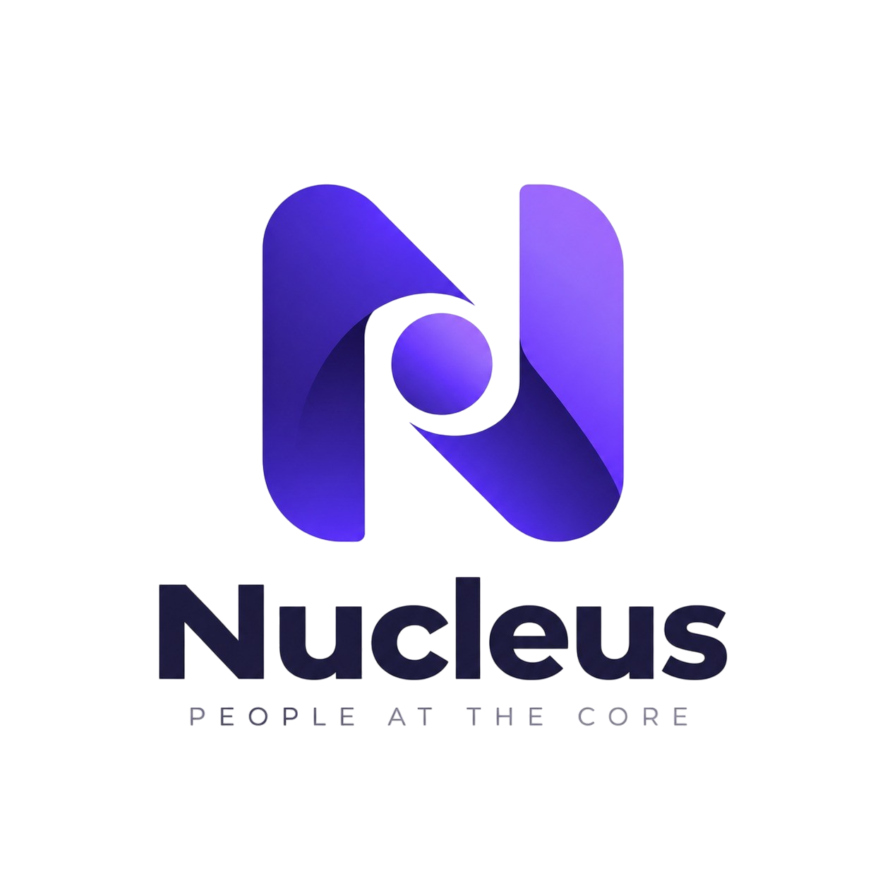

# Nucleus HRMS

<p align="center"></p>

Nucleus is a private human resources and workforce operations application for employee administration, attendance, leave, payroll, talent, compliance, and workforce intelligence. The current delivery phase is an interactive, JSON-backed frontend for local review. Existing server code is retained, but this phase does not connect the workspace to a live database or implement production services.

## Technology stack

| Layer | Technology |
| --- | --- |
| Framework | Next.js 16.3 App Router, React 19 |
| UI | Material UI v7 and direct `@mui/icons-material` imports for navigation; CSS Modules, Base UI and Framer Motion |
| Language | TypeScript for typed infrastructure and tests; JavaScript/JSX for existing workspace components |
| Data | JSON resources loaded through an asynchronous workspace service |
| Dashboard interactions | dnd-kit with pointer, touch and keyboard sensors; browser-local layout adapter |
| Charts and spreadsheets | ECharts 6 and SheetJS 0.20.3 |
| Quality | ESLint, TypeScript, Vitest, Node test runner and Playwright |
| Runtime | Node.js 22, npm with committed package lock |
| Hosting preparation | Vercel Next.js deployment and Netlify adapter; no static export |

## Quick start — localhost:3000

Run these commands from the repository root:

```bash
nvm use
npm install
```

Create `.env.local` with these local preview settings. If it already exists, update these keys and preserve other values:

```dotenv
APP_DATA_MODE=json
DEMO_AUTH_ENABLED=true
BETTER_AUTH_URL=http://localhost:3000
ALLOW_INITIAL_ADMIN_SIGNUP=false
```

Then start the frontend:

```bash
npm run dev
```

Open **http://localhost:3000/login** and sign in with `superadmin@nucleus.com` and the shared demo password documented in [ROLE_MODEL.md](docs/engineering/ROLE_MODEL.md). These are synthetic demo credentials. The local configuration is ignored by Git. Demo identity is held in memory, so a browser reload requires sign-in again. Forms update preview state; they do not persist to a server. No database migration, ORM setup, AI key or database credentials are required for UI review.

For a fixed local address and port:

```bash
npm run dev -- --hostname localhost --port 3000
```

### Resolving “This workspace is not enabled”

The check is in `src/app/api/workspace-data/route.ts`, not middleware. It rejects the synthetic snapshot unless `DEMO_AUTH_ENABLED=true`. `WorkspaceDataBoundary` displays its response. `.env` and `.env.example` keep demo access disabled as a deployment safeguard; `.env.local` explicitly enables it for local review. Restart the dev server after changing environment files. An exported shell variable takes precedence over `.env.local`; use `DEMO_AUTH_ENABLED=true npm run dev` if your shell sets it to false.

Do not remove the access check or copy local demo settings into a customer production deployment. `APP_DATA_MODE=database` is not implemented. `npm run release:check` intentionally reports remaining production integration work.

## Source architecture

```text
src/
├── app/          # Next.js App Router (Layouts, Pages, Route Handlers)
├── components/   # Shared UI components (Sidebar, Navbar, Cards, etc.)
├── context/      # React Context providers (Auth, Theme, State)
├── data/         # Mock data, static constants, menu configurations
├── hooks/        # Custom React hooks
├── lib/          # Core libraries, client setups, configurations
├── server/       # Server actions / server-only utilities
├── services/     # API service layers
└── utils/        # Helper functions and formatting utilities
```

The application currently has one browser entry page (`src/app/page.js`). Its workspace panels are selected through navigation state; they are not independent filesystem routes. API route handlers remain under `src/app/api/`. Avoid inventing `/payroll` or `/employees` URLs until dedicated pages or a URL-backed workspace state are introduced.

`WorkspaceDataBoundary` loads the JSON snapshot before dynamically mounting the workspace. `src/services/workspace-data.mjs` provides asynchronous loading, error/retry behavior and defensive reads. View records and copy live in `src/data/ui/`; operational datasets live in `src/data/workbook.json`. Continue using this boundary during UI work. Future domain services can replace the JSON adapter after interface approval.

`AuthContext` controls demo identity and preview permissions; `HRMSContext` owns browser workflow state. `src/hooks/useKeyboardShortcut.js` owns the workspace shortcut lifecycle. Existing backend utilities and schemas are not part of the current implementation scope and must not be treated as evidence that UI workflows are production-integrated.

## Menu navigation layout

The canonical menu hierarchy is `src/data/ui/navigation.catalog.json`. `src/lib/workspace-navigation.js` resolves its icon names through direct MUI imports. The module chooser, contextual submenu and feature catalog share this hierarchy. Parent groups organize the existing panels and all 49 operational screens; permissions filter what a persona sees.

| Parent menu | Submenu groups |
| --- | --- |
| Dashboard Consoles | Executive & Operational Consoles |
| Core HR | Foundation & Lifecycle, Organization & Governance, People & Lifecycle, Attendance Operations, Leave Operations |
| Talent | Acquisition & Performance, Growth & Recognition, Talent & Experience Operations |
| Payroll & Finance | Payroll & Compensation, Statutory & Accounting, Payroll & Finance Operations |
| Workforce Operations | Scheduling & Workforce, Operations & Assets, Workforce Operations |
| Analytics & AI | Dashboards & Intelligence, Ai & Custom Reporting, Intelligence Operations |
| Platform & Admin | Integrations & Automation, Security & Governance, Compliance Engineering, Integration Operations |

Use **Modules** or **⌘M / Ctrl+M / Alt+M** to open the menu chooser. The left dock selects a domain, the right navigation lists its children, and the feature catalog provides searchable cards. Dashboard consoles S1–S10 are entries under Dashboard Consoles. Console and module visibility respect the current demo persona; browser controls are not a production authorization boundary.

The complete item-to-panel map is in [Navigation inventory](docs/NAVIGATION_INVENTORY.md). Menu validation checks that every registered operational screen is reachable and every icon resolves to an installed MUI module.

## Process workbook coverage

The reference workbook is [Nucleus Process Flows and Process Maps v1.0](docs/Nucleus_Process_Flows_and_Process_Maps_v1.0.xlsx). All 23 sheets are inventoried in [Workbook UI coverage](docs/WORKBOOK_UI_COVERAGE.md), with row-level details in `docs/WORKBOOK_UI_COVERAGE.json`.

All 49 screen IDs match an operational UI surface. This establishes navigation coverage, **not complete feature implementation**. The workbook also specifies conditional fields, validations, state machines, offline behavior, approval chains, integrations and nonfunctional gates. These remain partial or deferred. Each operational screen has a Process guide displaying its source actions, fields, steps and rules for interface comparison.

Regenerate the reference mapping after the workbook changes:

```bash
python3 scripts/generate-process-ui-map.py
npm run data:manifest
```

The generator reads the workbook without editing it. Workbook instructions are treated as reference content, not executable commands. Full service/database implementation begins only after UI approval.

## Branding and public assets

Use `/images/logo.png` for the supplied Nucleus artwork. Favicons and the manifest are under `/images/favicon_io/`; `src/app/favicon.ico` mirrors the supplied ICO for the App Router convention. Root metadata declares PNG and Apple touch icons and the web manifest.

Files inside `public/` are served from `/`: `public/images/file.svg` becomes `/images/file.svg`, never `/public/images/file.svg`. Preserve external image URLs. The manifest icon URLs also use the moved directory.

## Configuration and deployment boundaries

`.env.example` documents supported settings. Next.js determines `NODE_ENV`; leave it out of shared environment files. Session and optional AI variables are only relevant to later backend integration. Do not commit secrets or expose them through `NEXT_PUBLIC_` variables.

For an isolated Netlify UI preview, the supplied `netlify.toml` uses Node 22, `npm run build`, `.next`, and the Next.js adapter. Set `APP_DATA_MODE=json`, `DEMO_AUTH_ENABLED=true`, and the actual HTTPS `BETTER_AUTH_URL` in Builds and Functions. Protect the preview at the hosting level and use synthetic data. A private repository does not make its deployed website private.

### Vercel synthetic preview

Import this private repository into the `mk-raft1` team, choose Next.js, keep the root directory at the repository root, and use Node.js 22.x. `vercel.json` sets `npm ci` and `npm run build`; leave the output directory at the framework default.

Set these server environment variables for Production and Preview before deploying:

| Variable | Value |
| --- | --- |
| `APP_DATA_MODE` | `json` |
| `DEMO_AUTH_ENABLED` | `true` |
| `ALLOW_INITIAL_ADMIN_SIGNUP` | `false` |
| `BETTER_AUTH_URL` | The project's actual HTTPS production origin, without a path |

Leave database URLs, AI keys, `DEMO_TEST_PASSWORD` and `NODE_ENV` unset. JSON preview login does not need a Better Auth secret. Additional custom login origins can be listed exactly in `ADDITIONAL_TRUSTED_ORIGINS`; do not use wildcards. Environment changes require a new deployment. See [Vercel environment commands](https://vercel.com/docs/cli/env).

For CLI delivery, run `vercel link --scope mk-raft1`, configure the variables, then `vercel deploy --prod --scope mk-raft1`. `.vercelignore` excludes local environment files, private credential references, documentation and test artifacts from CLI uploads. Hosting access controls are separate from the demo login; the synthetic snapshot is available before sign-in. Verify `/`, `/login`, `/workspace`, all five role logins, and sign-out after deployment.

Customer production remains blocked on real sessions, tenant-scoped reads, durable writes, integrations and operational verification. Do not run migrations or add live service logic during this frontend review phase.

## Quality checks

```bash
npm run typecheck
npm run lint
npm test
npm run test:ui
npm run test:e2e
npm run build
```

Playwright starts its own local server on port 3100. Install Chromium with `npx playwright install chromium`, or set `PLAYWRIGHT_CHROMIUM_EXECUTABLE_PATH` to an installed Chrome executable. Do not run the Next production build concurrently with the browser suite. Database tests are opt-in and skipped without a configured disposable database; passing unit tests does not certify production integrations.

Run `npm run data:manifest` whenever JSON resource keys change. `npm ci` provides lockfile-based installs in CI. SheetJS uses its official pinned distribution tarball rather than the outdated npm-registry package.

## License

Private and proprietary. See [LICENSE](LICENSE). No public open-source license is granted. Third-party dependencies retain their respective licenses.

## Repository governance

Read [AGENTS.md](AGENTS.md) and [engineering guidance](docs/engineering/README.md) before changing the application. The [role model](docs/engineering/ROLE_MODEL.md) defines the five preview accounts and their limits.

## Public website and personal dashboards

The public website provides Home (`/`), About (`/about`), Features (`/features`), Why Nucleus (`/why-nucleus`), Docs (`/docs`) and Contact (`/contact`). `/login` opens the demo sign-in; successful sign-in opens `/workspace` with the existing navigation structure. Logout returns to Home. The contact preview downloads an enquiry draft and does not send email.

Superadmin, HR Manager and Employee can customize their starting dashboards: drag with pointer/touch/keyboard, add or remove permitted widgets, edit titles and sizes, change density and colours, undo/redo, apply presets and save up to six named layouts. Import/export contains presentation settings only. Layouts persist on the current browser per account/role/console; operational records remain temporary. See [dashboard customization](docs/engineering/DASHBOARD_CUSTOMIZATION.md) for the complete behavior and limitations.

Public website content and dashboard definitions are JSON-backed through separate async adapters. No live backend, database or contact integration is added by these features.

## Responsive interface

The workspace adapts to phone, tablet and desktop widths while preserving role permissions. Mobile navigation uses the labeled Modules menu; dashboards stack, forms reflow, and wide tables remain scrollable with keyboard access. Light/dark workspace colors also apply to MUI dialogs and controls. See [device behavior and verification](docs/engineering/RESPONSIVE_UX.md).

### Appearance across the application

Choose the palette icon in the public, login or workspace header: **Pearl violet**, **Graphite night** (the preserved dark palette), **Slate blue**, or **Sage teal**. The selection persists across navigation, sign-in, sign-out and browser reloads, and synchronizes across tabs. Shared semantic tokens keep page surfaces, text, inputs and MUI dialogs coordinated. See [responsive and appearance guidance](docs/engineering/RESPONSIVE_UX.md).
