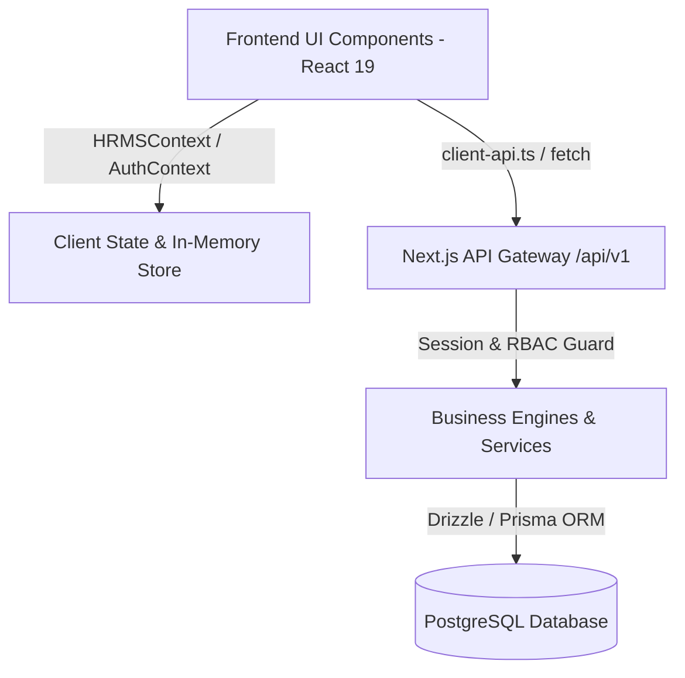

# Nucleus HRMS — Backend & Frontend Integration Status Document
**Document Version:** 1.0.0
**Project:** Nucleus UI / HRMS Enterprise Edition
**Tech Stack:** Next.js 16 (App Router), React 19, Drizzle ORM / Prisma, PostgreSQL, Better Auth, LangChain/LangGraph AI
**Last Updated:** September 13, 2026

---

## 1. Executive Summary & Integration Architecture

Nucleus HRMS is structured with a decoupled, high-performance architecture:
1. **Frontend Presentation Layer (`src/components/`)**: Built using Next.js 16 App Router and React 19. Features 10 primary workspace cockpits (`S1` to `S10`) and 20+ specialized Clerio sub-system views (`LeaveView`, `AttendanceView`, `PayrollView`, `ComplianceView`, etc.).
2. **State & Mock Bridge Layer (`src/context/`)**: Orchestrated by `HRMSContext.js` and `AuthContext.js`. Provides rich, client-side interactive state for instantaneous demonstration, UI responsiveness, and offline development.
3. **API & Gateway Layer (`src/app/api/v1/`)**: Defines 74 REST resource families with versioned contracts (`/api/v1/*`), JWT/Session middleware authentication, and RBAC permission checks.
4. **Business Engine Services (`src/services/`)**: Houses calculation engines including `leaveEngine.js`, `timeOfficeEngine.js`, `payrollAdjacenciesService.js`, `erpAndComplianceService.js`, and `establishmentService.js`.
5. **Database & Data Access Layer (`src/lib/db/schema.ts` & `prisma/schema.prisma`)**: Fully modeled PostgreSQL schema with Drizzle ORM and Prisma ORM for multi-tenant isolation, employees, attendance days/punches, leave balances/requests, payroll runs/anomalies, loans, and audit trails.

### Status Legend
* 🟢 **Fully Integrated**: End-to-end connection between Frontend UI components, State Context, Backend API Routes, and Database / AI Services.
* 🟡 **Hybrid / Ready to Bridge**: Frontend UI and Backend APIs / Calculation Engines are 100% built independently; UI is currently bound to `HRMSContext` mock state and can be swapped to live endpoints using `src/lib/client-api.ts`.
* 🔴 **Pending / In Planning**: UI component or backend API route is in design phase.

---

## 2. Master Integration Status Matrix by Module



---

### Module 1: Authentication, Authorization & Identity
**Overall Status:** 🟢 **Fully Integrated**

| Sub-Module | Component(s) | Key Features | Backend Route / Engine | DB Tables | Status |
| :--- | :--- | :--- | :--- | :--- | :---: |
| **User Login & Session** | `LoginView.js`<br>`AuthContext.js` | Multi-tenant auth, credentials login, session tokens, JWT persistence | `POST /api/auth/login`<br>`GET /api/me`<br>`GET /api/v1/identity/context` | `user`, `session`, `account` | 🟢 Fully Integrated |
| **RBAC & Role Switching** | `TopNav.js`<br>`AccessControlView.js` | Role switching (Employee, Manager, HR Admin, Finance, Super Admin), Permission matrix display | `POST /api/v1/roles`<br>`POST /api/v1/memberships/roles`<br>`GET /api/v1/tenant/settings` | `memberships`, `tenants` | 🟢 Fully Integrated |

---

### Module 2: Core HR & People Directory
**Overall Status:** 🟡 **Hybrid / Ready to Bridge**

| Sub-Module | Component(s) | Key Features | Backend Route / Engine | DB Tables | Status |
| :--- | :--- | :--- | :--- | :--- | :---: |
| **Employee Master Directory** | `PeopleCoreView.js`<br>`PeopleCommandCentre.js`<br>`TeamView.js` | Profile directory, search & filtering, department hierarchy, designation levels, manager links | `GET /api/v1/people`<br>`GET /api/v1/people/:id`<br>`GET /api/v1/organization/tree` | `employees`, `tenants` | 🟡 Hybrid |
| **Onboarding & Offboarding** | `OnboardingView.js`<br>`CMSModal.js` | Candidate onboarding pipeline, task checklist, document upload, offboarding clearance | `GET /api/v1/onboarding/instances`<br>`POST /api/v1/offboarding/cases` | `vpFeatureRecords`, `auditEvents` | 🟡 Hybrid |

---

### Module 3: Attendance & Time Office Management
**Overall Status:** 🟡 **Hybrid / Ready to Bridge**

| Sub-Module | Component(s) | Key Features | Backend Route / Engine | DB Tables | Status |
| :--- | :--- | :--- | :--- | :--- | :---: |
| **Smart Punch In/Out** | `AttendanceFAB.js`<br>`AttendanceWidget.js` | One-tap floating punch action, geo-location, device metadata, real-time timer | `POST /api/v1/attendance/punches`<br>`POST /api/attendance/punch` | `attendancePunches` | 🟢 Fully Integrated |
| **Attendance Intelligence & Shifts** | `AttendanceView.js`<br>`AttendanceIntelligence.js`<br>`HROpsConsole.js` | Shift auto-detection, gross span calculation, late arrival/early exit flags, regularization & gate pass workflows | `GET /api/v1/attendance/days`<br>`POST /api/v1/regularizations`<br>`POST /api/v1/gate-passes`<br>**Engine:** `timeOfficeEngine.js` | `attendanceDays` | 🟡 Hybrid |

---

### Module 4: Leave Management
**Overall Status:** 🟡 **Hybrid / Ready to Bridge**

| Sub-Module | Component(s) | Key Features | Backend Route / Engine | DB Tables | Status |
| :--- | :--- | :--- | :--- | :--- | :---: |
| **Leave Application & Balances** | `LeaveView.js` | Earned, Casual & Sick leave request, real-time balance ledger, Sandwich Leave evaluator, Comp-off grant requests | `GET /api/v1/leave-requests`<br>`GET /api/v1/leave-balances`<br>`POST /api/v1/coff-grants`<br>**Engine:** `leaveEngine.js` | `leaveBalances`, `leaveRequests`, `leaveApprovals` | 🟡 Hybrid |

---

### Module 5: Weekly Timesheets & Project Logging
**Overall Status:** 🟡 **Hybrid / Ready to Bridge**

| Sub-Module | Component(s) | Key Features | Backend Route / Engine | DB Tables | Status |
| :--- | :--- | :--- | :--- | :--- | :---: |
| **Project Time Logging** | `EmployeeHome.js` (S1)<br>`ProjectView.js` | Sprint weekly timesheets, task time entry modal, billable vs non-billable tracking, project allocation | `GET /api/timesheets/active`<br>`POST /api/timesheets/entries`<br>`POST /api/timesheets/:id/submit` | `Timesheet`, `TimesheetEntry`, `Project` | 🟡 Hybrid |

---

### Module 6: Payroll Processing & Statutory Compliance
**Overall Status:** 🟡 **Hybrid / Ready to Bridge**

| Sub-Module | Component(s) | Key Features | Backend Route / Engine | DB Tables | Status |
| :--- | :--- | :--- | :--- | :--- | :---: |
| **Payroll Calculation & Control Room** | `PayrollView.js`<br>`PayrollControlRoom.js` (S5) | 2026 Wage Code 50% floor check, statutory deductions (EPF 12%, ESI 0.75%, PT ₹200, TDS 115BAC), LOP calculation, anomaly detection, payslip PDF generation | `GET /api/v1/payroll-runs`<br>`POST /api/v1/payroll-runs/:id/calculate`<br>`GET /api/v1/payslips/:id`<br>**Engine:** `payrollAdjacenciesService.js` | `payrollRuns`, `payrollAnomalies`, `loans` | 🟡 Hybrid |
| **Statutory Compliance Vault** | `ComplianceView.js` | Form 16 tax certificates, PF/ESI return summaries, labor law registers, compliance score | `GET /api/v1/compliance/obligations`<br>`POST /api/v1/compliance/evidence`<br>**Engine:** `establishmentService.js` | `vpRuleSets`, `auditEvents` | 🟡 Hybrid |

---

### Module 7: Manager Cockpit & Approvals Engine
**Overall Status:** 🟡 **Hybrid / Ready to Bridge**

| Sub-Module | Component(s) | Key Features | Backend Route / Engine | DB Tables | Status |
| :--- | :--- | :--- | :--- | :--- | :---: |
| **Multi-Level Approval Queue** | `ManagerCockpit.js` (S7)<br>`ApprovalActionModal.js` | Centralized approval inbox (Leaves, Timesheets, Expenses), SLA deadline tracking (24h timer), approve/reject with mandatory remarks, rerouting flow | `GET /api/approvals/pending`<br>`POST /api/approvals/:id/action`<br>`POST /api/v1/leave-requests/:id/decide` | `leaveApprovals`, `auditEvents` | 🟡 Hybrid |

---

### Module 8: Talent Acquisition & Performance Management
**Overall Status:** 🟡 **Hybrid / Ready to Bridge**

| Sub-Module | Component(s) | Key Features | Backend Route / Engine | DB Tables | Status |
| :--- | :--- | :--- | :--- | :--- | :---: |
| **Recruitment ATS & Pipeline** | `TalentAcquisition.js` (S8)<br>`RecruitmentView.js` | Job requisition creation, candidate sourcing pipeline (Sourcing $\rightarrow$ Screening $\rightarrow$ Interview $\rightarrow$ Offer), 0-100 interview scoring, offer letter issue | `POST /api/v1/requisitions`<br>`POST /api/v1/candidates`<br>`POST /api/v1/applications`<br>`POST /api/v1/offers` | `vpFeatureRecords` | 🟡 Hybrid |
| **Performance, OKRs & Goals** | `PerformanceTalent.js` (S6)<br>`PerformanceView.js` | OKR target setting (Q1-Q4), goal progress tracking, 360-degree feedback, performance calibration matrix | `POST /api/v1/objectives`<br>`POST /api/v1/key-results`<br>`POST /api/v1/review-cycles`<br>`POST /api/v1/calibration-sessions` | `Goal` | 🟡 Hybrid |

---

### Module 9: Nucleus AI & Conversational Engine
**Overall Status:** 🟢 **Fully Integrated**

| Sub-Module | Component(s) | Key Features | Backend Route / Engine | DB Tables | Status |
| :--- | :--- | :--- | :--- | :--- | :---: |
| **Conversational HR Assistant (RAG)** | `AIPanel.js`<br>`NucleusIntelligence.js` (S9)<br>`ChatPanel.js` | Natural language query box, instant policy RAG search, voice query parsing, leave & payslip quick lookup | `POST /api/agent`<br>`POST /api/v1/ai/runs`<br>`GET /api/v1/ai/knowledge` | `auditEvents` | 🟢 Fully Integrated |

---

### Module 10: Platform, Integrations & ERP Sync
**Overall Status:** 🟡 **Hybrid / Ready to Bridge**

| Sub-Module | Component(s) | Key Features | Backend Route / Engine | DB Tables | Status |
| :--- | :--- | :--- | :--- | :--- | :---: |
| **ERP Sync & External Webhooks** | `IntegrationsView.js`<br>`MagnetixCapability.js` (S10) | SAP / Workday / Oracle ERP connectors, inbound/outbound webhooks, capability maturity score | `GET /api/v1/integrations/connections`<br>`POST /api/v1/webhooks/endpoints`<br>`GET /api/v1/vp/readiness`<br>**Engine:** `erpAndComplianceService.js` | `vpErpRecords`, `vpRuleSets` | 🟡 Hybrid |

---

## 3. Component & Feature Integration Directory

### A. Main Workspaces (`S1` – `S10`)

| Workspace ID | Component File | Key Features | Primary Backend Target | Status |
| :--- | :--- | :--- | :--- | :---: |
| **S1** | `EmployeeHome.js` | Daily focus, quick attendance punch, weekly timesheet logging, team activity feed | `/api/timesheets/active`, `/api/attendance/punch` | 🟡 Hybrid |
| **S2** | `PeopleCommandCentre.js` | Headcount metrics, turnover analysis, department split, manager reporting chain | `/api/v1/people`, `/api/v1/organization/tree` | 🟡 Hybrid |
| **S3** | `AttendanceIntelligence.js` | 8-week attendance heatmap, late arrival trends, shift anomaly detector | `/api/v1/attendance/days` | 🟡 Hybrid |
| **S4** | `HROpsConsole.js` | Operational ticket queues, SLA violation monitor, workflow execution logs | `/api/v1/ops/audit-events` | 🟡 Hybrid |
| **S5** | `PayrollControlRoom.js` | Run payroll wizard, gross-to-net summary chart, statutory compliance audit | `/api/v1/payroll-runs` | 🟡 Hybrid |
| **S6** | `PerformanceTalent.js` | OKR completion dashboard, skill matrix, high-performer / flight-risk quadrant | `/api/v1/review-cycles` | 🟡 Hybrid |
| **S7** | `ManagerCockpit.js` | Team availability grid, approval SLA countdown timer, pending action list | `/api/approvals/pending` | 🟡 Hybrid |
| **S8** | `TalentAcquisition.js` | Kanban recruitment board, candidate pipeline cards, requisition approvals | `/api/v1/applications` | 🟡 Hybrid |
| **S9** | `NucleusIntelligence.js` | AI prompt hub, RAG document search history, automated insight generator | `/api/agent`, `/api/v1/ai/runs` | 🟢 Integrated |
| **S10** | `MagnetixCapability.js` | System integration health, ERP sync status, capability maturity score | `/api/v1/integrations/connections` | 🟡 Hybrid |

---

### B. Specialized Clerio Sub-Modules

| Sub-Module View | Component File | Key Features | Primary Backend Target | Status |
| :--- | :--- | :--- | :--- | :---: |
| **Attendance** | `AttendanceView.js` | Punch history table, shift regularizations, gate pass log | `/api/v1/attendance/days` | 🟡 Hybrid |
| **Leave** | `LeaveView.js` | Apply leave modal, balance counters, Sandwich rule badge | `/api/v1/leave-requests` | 🟡 Hybrid |
| **Payroll** | `PayrollView.js` | Payslip breakdown modal, tax regime selector (Old/New), EPF/ESI details | `/api/v1/payslips/:id` | 🟡 Hybrid |
| **Access Control** | `AccessControlView.js` | Role permissions grid, user assignment modal, invitation generator | `/api/v1/roles`, `/api/v1/invitations` | 🟢 Integrated |
| **Analytics** | `AnalyticsView.js` | Interactive Echarts visualizations, workforce trends, attrition rate | `/api/v1/analytics/metrics` | 🟡 Hybrid |
| **Compensation** | `CompensationView.js` | Salary band planner, merit increment budget, promotion simulator | `/api/v1/compensation/proposals` | 🟡 Hybrid |
| **Compliance** | `ComplianceView.js` | Form 16, PF/ESI challans, labor registers, compliance score | `/api/v1/compliance/obligations` | 🟡 Hybrid |
| **Contract Workforce** | `ContractWorkforceView.js` | Vendor/Agency management, contractor shift log, invoice variance check | `/api/v1/contractors/invoices` | 🟡 Hybrid |
| **Helpdesk** | `HelpdeskView.js` | Employee support tickets, SLA tracking, resolution notes | `/api/v1/ops/audit-events` | 🟡 Hybrid |
| **Integrations** | `IntegrationsView.js` | ERP connector cards (SAP, Oracle, Workday, Slack), API keys | `/api/v1/integrations/connections` | 🟡 Hybrid |
| **Learning** | `LearningView.js` | Course catalog, learning path progress, compliance training completion | `/api/v1/courses` | 🟡 Hybrid |
| **Project Management**| `ProjectView.js` | Project cost tracking, billable hour allocation, client codes | `/api/timesheets/entries` | 🟡 Hybrid |
| **Recruitment** | `RecruitmentView.js` | Open job positions, applicant resume parsing, interview scheduling | `/api/v1/job-postings` | 🟡 Hybrid |
| **Settings** | `SettingsView.js` | Tenant branding, currency, timezone, shift rules configuration | `/api/v1/tenant/settings` | 🟡 Hybrid |
| **Team Directory** | `TeamView.js` | Department org chart, team member contact details, reporting lines | `/api/v1/organization/tree` | 🟡 Hybrid |

---

## 4. Step-by-Step Backend Bridge Roadmap

To transition any **Hybrid** module to **Live Backend Mode**, follow these steps:

1. **Verify Database Connection**: Ensure `DATABASE_URL` in `.env` is pointing to an active PostgreSQL database.
2. **Run Migrations & Seeders**:
   ```bash
   npm run db:generate
   npm run db:migrate
   npm run seed:demo-tenants
   ```
3. **Connect Frontend Component via `client-api.ts`**:
   In `src/context/HRMSContext.js` or the target component, replace local state mutators with `getJson()`:
   ```javascript
   import { getJson } from '@/lib/client-api';

   // Example: Loading live attendance summary
   const fetchAttendanceData = async () => {
     try {
       const data = await getJson('/api/v1/attendance/days');
       setAttendanceDays(data.days);
     } catch (err) {
       console.error("Failed to load attendance", err);
     }
   };
   ```
4. **Invalidate Cache on Writes**: Use `invalidateGetRequest('/api/v1/attendance/days')` after POST actions to ensure UI immediately reflects database state.

---
*Document generated automatically for Nucleus HRMS Engineering & Product Handoff.*
