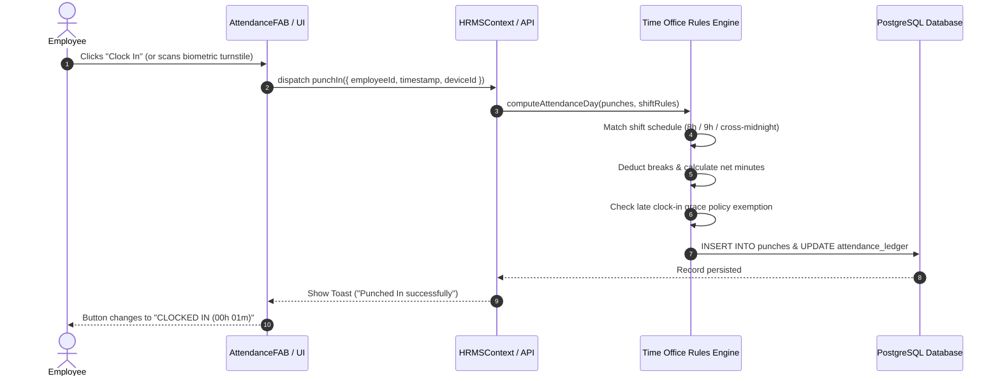
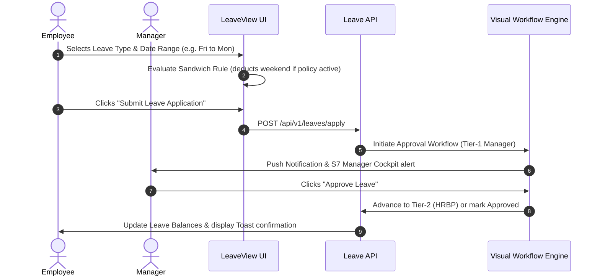
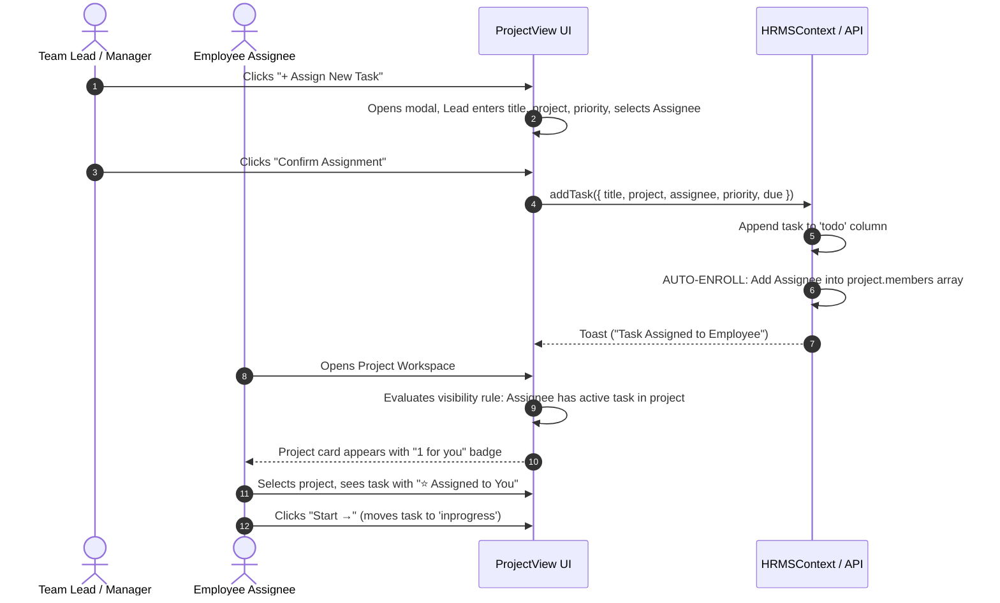

# Nucleus HRMS — Complete Architectural Blueprint & System Specification

**Document Type:** Master System Architecture, UI Component Hierarchy & Backend Engineering Specification  
**Application:** Nucleus HRMS (Enterprise Workforce & Operations Platform)  
**Version:** 2.0.0-PROD  
**Target Audience:** Backend Developers, Full-Stack Engineers, System Architects, QA Engineers, DevOps  
**Frontend Stack:** Next.js 16 (App Router / Turbopack), React 19, ECharts, Lucide Icons, CSS Modules  
**State Architecture:** Context API (`AuthContext`, `HRMSContext`) with Deterministic Rules Engine  

---

## Table of Contents
1. [Application Shell & Skeleton Breakdown](#1-application-shell--skeleton-breakdown)
   - [1.1 Root Layout & App Entry Point](#11-root-layout--app-entry-point)
   - [1.2 Header & Top Navigation (TopNav)](#12-header--top-navigation-topnav)
   - [1.3 Left Dock (LeftDock)](#13-left-dock-leftdock)
   - [1.4 Dual-Pane Navigation (DualPaneNav)](#14-dual-pane-navigation-dualpanenav)
   - [1.5 Main Workspace Container (MainWorkspace)](#15-main-workspace-container-mainworkspace)
   - [1.6 Right Slide-Out Panels (AI Copilot & Chat)](#16-right-slide-out-panels-ai-copilot--chat)
   - [1.7 Floating Action Hub (AttendanceFAB)](#17-floating-action-hub-attendancefab)
   - [1.8 Global Modal & Notification Suite](#18-global-modal--notification-suite)
2. [Complete Module & Sub-Module Directory (18 Modules)](#2-complete-module--sub-module-directory-18-modules)
   - [Module 1: People Core & Org Directory](#module-1-people-core--org-directory)
   - [Module 2: Attendance, Shifts & Time Office](#module-2-attendance-shifts--time-office)
   - [Module 3: Leave Engine & Workflows](#module-3-leave-engine--workflows)
   - [Module 4: Lifecycle, Onboarding & Hardware Assets](#module-4-lifecycle-onboarding--hardware-assets)
   - [Module 5: Organization Management & Team Hierarchy](#module-5-organization-management--team-hierarchy)
   - [Module 6: Global Payroll, EWA & Loan Engine](#module-6-global-payroll-ewa--loan-engine)
   - [Module 7: Compensation, Bands & Benefits](#module-7-compensation-bands--benefits)
   - [Module 8: Statutory Compliance & Factories Act](#module-8-statutory-compliance--factories-act)
   - [Module 9: Talent Acquisition & ATS Pipeline](#module-9-talent-acquisition--ats-pipeline)
   - [Module 10: Performance, OKRs & 9-Box Calibration](#module-10-performance-okrs--9-box-calibration)
   - [Module 11: Learning & Development (L&D)](#module-11-learning--development-ld)
   - [Module 12: Employee Experience & Vedic Wellbeing](#module-12-employee-experience--vedic-wellbeing)
   - [Module 13: Contingent & Contract Workforce](#module-13-contingent--contract-workforce)
   - [Module 14: Agile Projects, Sprints & Tasks](#module-14-agile-projects-sprints--tasks)
   - [Module 15: People Intelligence & Analytics](#module-15-people-intelligence--analytics)
   - [Module 16: Grounded Policy Helpdesk](#module-16-grounded-policy-helpdesk)
   - [Module 17: Enterprise Integrations & API Platform](#module-17-enterprise-integrations--api-platform)
   - [Module 18: Access Control & RBAC Studio](#module-18-access-control--rbac-studio)
3. [The 10 Operational Cockpits (S1 - S10)](#3-the-10-operational-cockpits-s1---s10)
4. [End-to-End User Interaction Workflows](#4-end-to-end-user-interaction-workflows)
5. [Backend API Contract & Database Models](#5-backend-api-contract--database-models)

---

# 1. Application Shell & Skeleton Breakdown

```
┌────────────────────────────────────────────────────────────────────────────────────────┐
│                                    TOPNAV (Header)                                     │
│  [Logo] [Search ⌘K] [Cockpit S1-S10] [Persona Switcher] [+ Action] [🔔] [Theme] [Profile] │
├───────┬───────────────────────────────────────────────────────────────┬────────────────┤
│ LEFT  │                     MAIN WORKSPACE                            │ RIGHT DRAWER   │
│ DOCK  │  [Breadcrumbs: Feature Catalog / Active Module]               │ [AI Copilot /  │
│       │  [RoleProtected Boundary]                                     │  Live Chat]    │
│ [Cat] │  ───────────────────────────────────────────────────────────  │                │
│ [Pin] │  ACTIVE VIEW: (People Core / Payroll / Projects / etc.)       │                │
│ [Pin] │  - Header Row & Filter Bar                                    │                │
│ [Pin] │  - Metric KPI Strip (4 Stat Cards)                            │                │
│       │  - Sub-Tabs / Segmented Control                               │                │
│       │  - Data Grid / Kanban / Split Master-Detail Layout            │                │
│       │  ───────────────────────────────────────────────────────────  │                │
│       │                                [Attendance Floating FAB] ───► │                │
└───────┴───────────────────────────────────────────────────────────────┴────────────────┘
```

### 1.1 Root Layout & App Entry Point
- **Files:** `src/app/layout.js`, `src/app/page.js`, `src/app/globals.css`
- **Skeleton Role:** Mounts global styling variables, Google Fonts (`Inter`, `JetBrains Mono`), sets up the viewport, and wraps the DOM tree in `AuthProvider` and `HRMSProvider`.
- **Layout Behavior:**
  - Standard 3-column CSS Grid: `LeftDock` (fixed 52px) | `MainWorkspace` (flex 1, scrollable) | `Right Drawer` (off-canvas or 340px when open).
  - Handles keyboard accelerators: `⌘K` / `Ctrl+K` opens Global Command Palette; `⌘M` / `Ctrl+M` opens Dual-Pane Module Switcher; `ESC` closes all modals.

---

### 1.2 Header & Top Navigation (TopNav)
- **Files:** `src/components/Clerio/TopNav.js`, `TopNav.module.css`
- **Skeleton Elements:**
  1. **Branding & Logo:** Clickable brand icon returning user to `dashboard`.
  2. **Global Search Bar:** Input field with keyboard trigger hint (`⌘K`). Real-time auto-suggest across employees, modules, policies, and tickets.
  3. **Cockpit Dropdown (`S1` to `S10`):** Dropdown allowing users to switch between executive dashboards (People Command, HR Ops, Payroll Control, ESS Home).
  4. **Persona Switcher (RBAC Tester):** Multi-role switcher allowing live preview as `SUPER_ADMIN`, `HR_MANAGER`, `FINANCE_MANAGER`, `PROJECT_MANAGER`, `TEAM_LEAD`, or `EMPLOYEE`.
  5. **Quick Action Launcher (`+` Button):** Instant popover menu triggering:
     - `+ Quick Biometric Clock-In`
     - `+ Apply for Leave`
     - `+ Log Project Timesheet`
     - `+ Allocate Hardware Asset`
  6. **Notification Bell:** Live badge showing count of pending approvals, system alerts, and SLA warnings.
  7. **Theme Toggle:** Toggles between Dark Glass (`#0A101D`) and Light theme tokens.
  8. **Profile Dossier Menu:** Shows active user avatar, name, band, and sign-out action.

---

### 1.3 Left Dock (LeftDock)
- **Files:** `src/components/Clerio/LeftDock.js`, `LeftDock.module.css`
- **Skeleton Elements:**
  - Vertical 52px icon ribbon fixed on the left viewport margin.
  - **Feature Catalog Button:** Diamond icon with glowing pulse triggering the full-screen `DualPaneNav` / `CatalogGridView`.
  - **Pinned Fast-Nav Icons:** Quick jump icons for Dashboard (`LayoutDashboard`), People (`Users`), Sprints (`Briefcase`), Payroll (`CreditCard`), and Settings (`Settings`).
  - **Connection Pulse:** Green indicator signaling live WebSocket / ERP sync connection status.

---

### 1.4 Dual-Pane Navigation (DualPaneNav)
- **Files:** `src/components/Navigation/DualPaneNav.js`, `DualPaneNav.module.css`
- **Skeleton Elements:**
  - Full-screen modal triggered by clicking "Feature Catalog" or typing `⌘M`.
  - **Left Domain Pane (260px):** Lists 6 operational domains:
    1. Core HR (8 modules)
    2. Talent (7 modules)
    3. Payroll & Finance (7 modules)
    4. Workforce Operations (7 modules)
    5. Analytics & AI (4 modules)
    6. Platform (4 modules)
  - **Right Sub-Module Pane (flex-1):** Displays card grid of all sub-modules under the selected domain with titles, descriptions, icons, and direct navigation links.

---

### 1.5 Main Workspace Container (MainWorkspace)
- **Files:** `src/components/Clerio/MainWorkspace.js`, `MainWorkspace.module.css`
- **Skeleton Elements:**
  - **Breadcrumb Bar:** Shows current navigation hierarchy (e.g. `Feature Catalog / Agile Projects & Sprints`).
  - **`RoleProtected` Security Wrapper:** Wraps every module view. Validates that the active user's role has permission to access the module key. If blocked, displays unauthorized boundary card with "Request Access" action.
  - **Dynamic View Dispatcher:** Renders the active module component based on `activeTab`.

---

### 1.6 Right Slide-Out Panels (AI Copilot & Chat)
- **Files:** `src/components/Clerio/AIPanel.js`, `ChatPanel.js`
- **Skeleton Elements:**
  - **AIPanel (Grounded Copilot):** Real-time conversational interface connected to the agent API (`/api/agent`). Answers compliance queries, suggests attendance corrections, and drafts HR letters.
  - **ChatPanel (Team Messenger):** Real-time messaging panel with direct messaging channels and engineering pod discussions.

---

### 1.7 Floating Action Hub (AttendanceFAB)
- **Files:** `src/components/Clerio/AttendanceFAB.js`, `AttendanceFAB.module.css`
- **Skeleton Elements:**
  - Floating pill on bottom right corner of the screen.
  - Shows current clock state: `CLOCKED IN (04h 12m)` or `NOT CLOCKED IN`.
  - One-click button to toggle punch state (`Clock In` / `Clock Out`).
  - Geofence status indicator (e.g. `● BLR-HQ Plant Gate Verified`).

---

### 1.8 Global Modal & Notification Suite
- **Files:** `Toast.js`, `WorkflowBuilderModal.js`, `CMSModal.js`, `DataImportModal.js`
- **Skeleton Elements:**
  - **Toast Stack (`Toast.js`):** Top-right floating notification queue for operation feedback (`success`, `info`, `warning`, `error`).
  - **Workflow Designer (`WorkflowBuilderModal.js`):** Interactive flowchart canvas allowing node-based workflow configuration.
  - **Data Importer (`DataImportModal.js`):** 4-step wizard for uploading CSV/Excel datasets with automated column heuristics.

---

# 2. Complete Module & Sub-Module Directory (18 Modules)

```
┌──────────────────────────────────────────────────────────────────────────────────┐
│                             THE 18 HRMS MODULES                                  │
├─────────────────────────┬────────────────────────────┬───────────────────────────┤
│ Core HR                 │ Workforce Operations       │ Finance & Payroll         │
│  1. People Core         │  5. Organization & Teams   │  6. Global Payroll        │
│  2. Smart Attendance    │ 13. Contract Workforce     │  7. Compensation & Bands  │
│  3. Leaves Engine       │ 14. Agile Projects & Tasks │  8. Statutory Compliance  │
│  4. Digital Onboarding  │ 16. Policy Helpdesk        │ 17. ERP & Integrations    │
├─────────────────────────┼────────────────────────────┼───────────────────────────┤
│ Talent & Growth         │ Intelligence & Platform    │ Security & Governance     │
│  9. Talent ATS          │ 12. Experience & Vedic MCI │ 18. Access Control & RBAC │
│ 10. Performance & OKRs  │ 15. Analytics & Headcount  │                           │
│ 11. Learning (L&D)      │                            │                           │
└─────────────────────────┴────────────────────────────┴───────────────────────────┘
```

---

### Module 1: People Core & Org Directory
- **Component:** `src/components/Clerio/PeopleCoreView.js` (`activeTab === 'people_core'`)
- **Purpose:** Single source of truth for employee identity, job levels, bands, direct reports, and compliance dossiers.
- **Sub-Tabs / Views:**
  1. `Employee Directory`: Filterable master table with avatars, employee codes, roles, bands, reporting managers, and status.
  2. `Positions & Bands`: Job architecture matrix detailing bands (L1 to L6), salary bands, and open headcount allocations.
  3. `Digital Document Vault`: KYC, Aadhaar/Passport, employment agreements, and OCR-indexed contracts.
  4. `Audit Log`: Immutable ledger recording every designation, compensation, or bank account change with timestamp and actor.
- **Key UI Elements & Components:**
  - Search & Department filter toolbar.
  - Employee Table with columns: `Employee`, `ID`, `Band`, `Department`, `Reporting Manager`, `Location`, `Status`, `Action`.
  - **Interactive Reassign Manager Button & Modal:** Allows changing who any employee reports to with one click.
- **User Interactions:**
  - Searching by name, role, or department filter.
  - Clicking `[Change]` next to manager $\rightarrow$ opens `Reassign Reporting Manager Modal` $\rightarrow$ selecting new supervisor $\rightarrow$ confirms and triggers live reporting line re-routing.
  - Clicking `Export to CSV` $\rightarrow$ triggers CSV export.
  - Clicking `Upload Vault` $\rightarrow$ triggers document OCR pipeline.
- **Backend API Endpoints:**
  - `GET /api/v1/employees` — Fetch paginated employee directory.
  - `POST /api/v1/employees` — Create new employee dossier.
  - `PUT /api/v1/employees/:id/manager` — Reassign reporting manager.
  - `GET /api/v1/documents/:empId` — Fetch verified KYC documents.
  - `GET /api/v1/audit-logs` — Fetch compliance change logs.

---

### Module 2: Attendance, Shifts & Time Office
- **Component:** `src/components/Clerio/AttendanceView.js` (`activeTab === 'attendance'`)
- **Purpose:** Biometric punch ledger, 3-tier shift inference (8h day, 9h corporate, cross-midnight), overtime calculation, and gate pass management.
- **Sub-Tabs / Views:**
  1. `Monthly Punch Ledger`: Calendar view of daily presence, gross hours, break deductions, and net presence.
  2. `Gate Pass Quota & Request`: Gate pass application modal with live monthly quota countdown (max 240 mins / 2 instances).
  3. `Time Office Ledger`: Detailed punch table with device serials (`PLANT_GATE_A`, `OFFICE_TURNSTILE`), raw punch timestamps, and status reasons.
  4. `Worker Categories & Grace Rules`: Grace exemption rules for supervisors vs. daily wage operators.
- **Key UI Elements & Components:**
  - Top Metric Cards: `Monthly Presence Rate (%)`, `Total Overtime Hours`, `Active Anomalies`, `Gate Pass Quota Remaining`.
  - Punch In/Out button and biometric device simulator.
  - Gate Pass Application Modal: Reason, Duration (15m, 30m, 60m, 120m), Type (`Personal` vs `Official Duty`).
- **User Interactions:**
  - Submitting a Gate Pass request $\rightarrow$ evaluates quota $\rightarrow$ notifies manager for sign-off $\rightarrow$ adds approved minutes to net attendance.
  - Clicking `Recalculate Day` $\rightarrow$ re-runs shift inference DAG and updates OT payout.
- **Backend API Endpoints:**
  - `POST /api/v1/attendance/punch` — Record biometric punch (`IN`/`OUT`, device ID, geofence coordinates).
  - `GET /api/v1/attendance/ledger/:empId` — Retrieve daily computed attendance records.
  - `POST /api/v1/gate-pass/request` — Submit gate pass application.
  - `PUT /api/v1/gate-pass/:id/approve` — Approve/Reject gate pass.

---

### Module 3: Leave Engine & Workflows
- **Component:** `src/components/Clerio/LeaveView.js` (`activeTab === 'leaves'`)
- **Purpose:** Statutory leave accrual, sandwich weekend rules, multi-tier approval chains, comp-off credit ledger, and early return reconciliation.
- **Sub-Tabs / Views:**
  1. `Balances & Apply`: Live leave cards (Privilege Leave, Sick Leave, Casual Leave, Comp-Off) with application form.
  2. `Approval Pipeline`: Multi-stage approval visualizer (Tier-1 Line Manager $\rightarrow$ Tier-2 HRBP).
  3. `Comp-Off Credit Clock`: FIFO credit tracker expiring unavailed compensatory off hours after 60 days.
  4. `Early Return from Leave`: Formal workflow to shorten approved leave and re-credit unused days back to balance.
  5. `Statutory Policy Matrix`: Policy rules for sandwich deductions, maternity benefit caps, and rollover limits.
- **Key UI Elements & Components:**
  - Leave Application Form: Type picker, Date Range, Sandwich Rule toggle, Justification textarea.
  - Multi-tier Approval Stepper with pending / approved badges.
  - Early Return Modal: Application selector, Actual Return Date, reason.
- **User Interactions:**
  - Selecting dates that span across Saturday/Sunday $\rightarrow$ triggers live Sandwich Rule warning calculation.
  - Submitting leave $\rightarrow$ enqueues notification to direct reporting manager.
  - Manager approves $\rightarrow$ moves application to Tier-2 HR or marks Approved.
- **Backend API Endpoints:**
  - `GET /api/v1/leaves/balances/:empId` — Retrieve current leave balances.
  - `POST /api/v1/leaves/apply` — Apply for leave with sandwich rule validation.
  - `PUT /api/v1/leaves/:id/approve` — Advance approval step.
  - `POST /api/v1/leaves/early-return` — Submit early return from leave.

---

### Module 4: Lifecycle, Onboarding & Hardware Assets
- **Component:** `src/components/Clerio/OnboardingView.js` (`activeTab === 'onboarding'`)
- **Purpose:** Hardware serial asset tracking, HR letter merge studio, employee recognition awards, and 30-60-90 day milestone tracking.
- **Sub-Tabs / Views:**
  1. `Hardware Assets & Serials`: Asset register tracking laptops, monitors, smart cards, and serial numbers. Linked to F&F exit clearance.
  2. `HR Letter Studio`: Automated template merge studio generating Appointment, Increment, Promotion, and Relieving letters with variable injection.
  3. `Recognition & Awards`: Employee awards engine (Star of the Month, Spot Award) with bonus rewards payout.
  4. `Workflow Pipelines`: Active state machines executing onboarding checklists and IT zero-trust provisioning.
  5. `30-60-90 Milestones`: New hire probation evaluation checklists.
- **Key UI Elements & Components:**
  - Asset Allocation Modal: Equipment type, Brand, Model, Serial Number, Assignee dropdown, Replacement value.
  - Letter Preview Container: Real-time rendered document canvas with Print and Export PDF buttons.
  - Nominate Award Modal: Employee picker, Award type, Citation, Cash reward.
- **User Interactions:**
  - Clicking `+ Allocate Hardware Asset` $\rightarrow$ assigns laptop with serial number to employee $\rightarrow$ locks asset to employee's asset register.
  - Changing letter parameters $\rightarrow$ dynamically updates letter preview with zero latency.
  - Clicking `Mark Returned` $\rightarrow$ inspects equipment and clears asset hold for F&F.
- **Backend API Endpoints:**
  - `GET /api/v1/assets` — Retrieve enterprise hardware asset register.
  - `POST /api/v1/assets/allocate` — Assign serial-tracked asset to employee.
  - `PUT /api/v1/assets/:id/return` — Mark asset surrendered and verified.
  - `POST /api/v1/letters/render` — Generate merged PDF document.
  - `POST /api/v1/recognition/grant` — Broadcast recognition award and credit cash bonus.

---

### Module 5: Organization Management & Team Hierarchy
- **Component:** `src/components/Clerio/TeamView.js` (`activeTab === 'team'`)
- **Purpose:** Visual department trees, engineering pods, reporting line structures, and teammate contact directory.
- **Sub-Tabs / Views:**
  1. `Pod Directory`: Grid of cross-functional team pods (Frontend, Backend, DevOps, Design, HR, Finance).
  2. `Reporting Hierarchy`: Tree view showing direct supervisor and subordinate relations.
- **Key UI Elements & Components:**
  - Pod filter buttons (`All`, `Engineering`, `Product`, `Design`, `Infrastructure`, `HR`, `Finance`).
  - Teammate Card: Avatar, online/busy indicator, role, email, phone, and direct contact buttons (`Chat`, `Email`, `1-on-1`).
- **User Interactions:**
  - Clicking `Chat` $\rightarrow$ opens direct messaging drawer with teammate.
  - Filtering by pod $\rightarrow$ isolates pod members and shows active presence status.
- **Backend API Endpoints:**
  - `GET /api/v1/org/hierarchy` — Retrieve nested reporting structure.
  - `GET /api/v1/org/pods` — List functional pods and assigned members.

---

### Module 6: Global Payroll, EWA & Loan Engine
- **Component:** `src/components/Clerio/PayrollView.js` (`activeTab === 'payroll'`)
- **Purpose:** Gross-to-Net DAG calculation, multi-country tax deduction, Earned Wage Access (EWA) micro-payouts, company loans with guarantor locks, off-cycle payroll runs, and Full & Final (F&F) exit settlement.
- **Sub-Tabs / Views:**
  1. `Payroll Overview`: Monthly payroll summary (Basic, HRA, Special Allowance, PF, ESI, Professional Tax, TDS).
  2. `Off-Cycle Runs`: Ad-hoc payroll generation for bonus, overtime payouts, and statutory arrears.
  3. `Company Loans`: Loan application with 4x basic salary cap and 2-guarantor lock validation.
  4. `Earned Wage Access (EWA)`: Instant micro-disbursement of accrued unbilled wages.
  5. `Full & Final (F&F) Settlement`: Exit dues calculator, notice period recovery, gratuity (Form F), and 4-department No Dues sign-offs (IT, Admin, Finance, Manager).
- **Key UI Elements & Components:**
  - CTC Component Breakdown Card.
  - Loan Application Modal: Amount, Tenure (months), Purpose, Guarantor 1, Guarantor 2.
  - No Dues Multi-Department Checklist: IT Hardware, Library/Admin, Finance Advances, Manager KT.
  - Bank NEFT and Tally Prime XML export buttons.
- **User Interactions:**
  - Employee requests EWA $\rightarrow$ system checks accrued wage balance $\rightarrow$ instantly credits salary account.
  - HR applies for loan $\rightarrow$ validates that guarantors don't have overlapping loans $\rightarrow$ binds EMI to monthly payroll run.
  - Completing F&F $\rightarrow$ requires all 4 departments to sign off No-Dues before release of settlement funds.
- **Backend API Endpoints:**
  - `GET /api/v1/payroll/summary` — Fetch current month payroll aggregation.
  - `POST /api/v1/payroll/runs` — Initiate regular or off-cycle payroll run.
  - `POST /api/v1/payroll/ewa/request` — Request instant Earned Wage Access transfer.
  - `POST /api/v1/loans/apply` — Apply for company welfare loan.
  - `PUT /api/v1/fnf/:id/nodues` — Sign off department clearance.

---

### Module 7: Compensation, Bands & Benefits
- **Component:** `src/components/Clerio/CompensationView.js` (`activeTab === 'compensation'`)
- **Purpose:** Market salary benchmarking (Mercer/Radford), compa-ratio visualization, annual merit appraisal review, and flexible benefits selection.
- **Sub-Tabs / Views:**
  1. `Total Rewards Dossier`: Annual CTC breakdown and peer band comparison.
  2. `Compa-Ratio Distribution`: Bell-curve chart showing positioning relative to market median.
  3. `Flexible Benefits Wallet`: Employee selection for gym allowance, health insurance top-up, book allowance, and meal vouchers.
- **Key UI Elements & Components:**
  - Current CTC & Band Level KPI cards.
  - Interactive Benefit Toggle switches with immediate tax-exemption impact preview.
  - Download Total Rewards Statement button.
- **Backend API Endpoints:**
  - `GET /api/v1/compensation/:empId` — Fetch compensation breakdown.
  - `PUT /api/v1/compensation/flex-benefits` — Save flexible benefit elections.

---

### Module 8: Statutory Compliance & Factories Act
- **Component:** `src/components/Clerio/ComplianceView.js` (`activeTab === 'compliance'`)
- **Purpose:** 2026 Labour Codes simulator (50% wage floor rule), Factory Act 1948 registers (Form 18 accident notice, Form 36 inspection ledger), Form F Gratuity nominations, and SAP IDoc/NetSuite ERP general ledger journal sync.
- **Sub-Tabs / Views:**
  1. `Labour Codes Simulator`: Compares current wage structure vs. 50% Basic wage floor mandate and calculates PF/Gratuity impact.
  2. `Factory Registers (1948 Act)`: Form 18 (Notice of Accident to Inspectorate) and Form 36 (Statutory Inspection Book).
  3. `Form F Gratuity Nominations`: Nominee declaration with family member share percentages and witness endorsements.
  4. `ERP Financial Sync`: Double-entry salary journal posting (Debits == Credits check) to SAP S/4HANA or Oracle NetSuite.
- **Key UI Elements & Components:**
  - 50% Wage Floor Compliance Indicator: `PASS` / `FLAGGED (Under 50%)`.
  - Form 18 Accident Filing Modal: Injured person, Token No, Date, Occurrence place, Nature of injury, Remedial action.
  - GL Posting Batch Table with Debit/Credit validation badge and `Post Batch to ERP` trigger.
- **Backend API Endpoints:**
  - `POST /api/v1/compliance/factory-accident` — File Form 18 notice of accident.
  - `POST /api/v1/compliance/factory-inspection` — Log Form 36 inspectorate entry.
  - `POST /api/v1/erp/gl-posting` — Dispatch verified salary journal to ERP.

---

### Module 9: Talent Acquisition & ATS Pipeline
- **Component:** `src/components/Clerio/RecruitmentView.js` (`activeTab === 'recruitment'`)
- **Purpose:** Job requisition workflows with sanctioned capacity enforcement, candidate Kanban pipeline, interview scorecards, and employee referral tracking.
- **Sub-Tabs / Views:**
  1. `Candidate Pipeline`: Kanban board (`Sourced` $\rightarrow$ `Screening` $\rightarrow$ `Interview` $\rightarrow$ `Offer`).
  2. `Sanctioned Requisitions`: Department vacancy quotas comparing budgeted headcount against actual hires.
  3. `Employee Referrals`: Referral submission with milestone bounty payouts (Hired, 90-days completion).
- **Key UI Elements & Components:**
  - Create Requisition Modal: Title, Department, Type (`New Addition` vs `Replacement`), Vacated role, Budget.
  - Candidate Card: Avatar, candidate name, applied role, AI screening score, interview status.
- **User Interactions:**
  - Dragging candidate across Kanban columns $\rightarrow$ triggers automated interview scheduling or offer letter generation.
  - Submitting job requisition exceeding sanctioned quota $\rightarrow$ blocks submission unless Executive Board Waiver is checked.
- **Backend API Endpoints:**
  - `GET /api/v1/recruitment/candidates` — Fetch candidate pipeline.
  - `PUT /api/v1/recruitment/candidates/:id/stage` — Advance candidate stage.
  - `POST /api/v1/recruitment/requisitions` — Submit job requisition.
  - `POST /api/v1/recruitment/referrals` — Submit referral candidate.

---

### Module 10: Performance, OKRs & 9-Box Calibration
- **Component:** `src/components/Clerio/PerformanceView.js` (`activeTab === 'performance'`)
- **Purpose:** Company & pod OKRs, quarterly key result check-ins, 9-box talent matrix (Performance vs. Potential), and peer 360 feedback.
- **Sub-Tabs / Views:**
  1. `OKRs & Goals`: Cascade of company, team, and personal goals with completion percentage sliders.
  2. `9-Box Talent Matrix`: Interactive 3x3 grid categorizing employees (e.g. Star, High Potential, Core Performer, Action Needed).
  3. `360 Peer Review`: Structured feedback prompts on leadership, ownership, and velocity.
- **Key UI Elements & Components:**
  - 9-Box Interactive Grid with draggable candidate cards.
  - `+ Add OKR Goal` Button & Modal.
- **Backend API Endpoints:**
  - `GET /api/v1/performance/okrs` — Retrieve goal tree.
  - `PUT /api/v1/performance/okrs/:id` — Update key result progress.
  - `GET /api/v1/performance/talent-matrix` — Retrieve 9-box placement coordinates.

---

### Module 11: Learning & Development (L&D)
- **Component:** `src/components/Clerio/LearningView.js` (`activeTab === 'learning'`)
- **Purpose:** SCORM course catalog, compliance certification tracking, external content marketplace (Coursera/LinkedIn), and capability progression.
- **Sub-Tabs / Views:**
  1. `My Enrolled Courses`: Mandatory safety courses, infosec training, and engineering tracks.
  2. `Content Marketplace`: External catalog integrations.
- **Key UI Elements & Components:**
  - Course Card: Thumbnail, title, provider, duration, completion progress bar, `Resume Course` button.
  - Direct deep link to `S9 Magnetix Capability Cockpit`.
- **Backend API Endpoints:**
  - `GET /api/v1/learning/courses` — Retrieve enrolled and available courses.
  - `PUT /api/v1/learning/courses/:id/progress` — Update course completion percentage.

---

### Module 12: Employee Experience & Vedic Wellbeing
- **Component:** `src/components/Clerio/ExperienceView.js` (`activeTab === 'experience'`)
- **Purpose:** Mindful Culture Index (MCI), Vedic wisdom framework (Guna/Dosha energy rhythms), peer Kudos social feed, and points reward store.
- **Sub-Tabs / Views:**
  1. `MKraft Capability Index (MCI)`: Workplace vitality and burnout radar.
  2. `Vedic Wellbeing Schedule`: Daily circadian productivity blocks (Kapha endurance, Pitta analytical focus, Vata creative ideation).
  3. `Social Feed & Kudos`: Company recognition stream with points reward balance.
- **Key UI Elements & Components:**
  - MCI Radial Meter.
  - Kudos composer: Teammate mention, appreciation note, badge icon, points credit.
- **Backend API Endpoints:**
  - `GET /api/v1/experience/feed` — Retrieve social appreciation stream.
  - `POST /api/v1/experience/kudos` — Post public appreciation and reward points.

---

### Module 13: Contingent & Contract Workforce
- **Component:** `src/components/Clerio/ContractWorkforceView.js` (`activeTab === 'contract_workforce'`)
- **Purpose:** Vendor staffing management, turnstile biometric vs. contractor invoice hours reconciliation, and ghost worker prevention.
- **Sub-Tabs / Views:**
  1. `Invoice Reconciliation`: Monthly vendor billing variance comparing vendor claimed hours vs. biometric gate hours.
  2. `Staffing Vendors`: Vendor performance scorecards, active headcount, and compliance certificates.
  3. `Contractor Roster`: List of active daily wagers with turnstile RFID badge numbers.
- **Key UI Elements & Components:**
  - Discrepancy Breakdown Table showing overbilled hours per worker.
  - Action buttons: `Accept Reconciled Invoice`, `Dispute Inflated Hours`.
- **Backend API Endpoints:**
  - `GET /api/v1/contractors/reconciliation` — Fetch billing discrepancy reports.
  - `POST /api/v1/contractors/dispute` — File hours variance dispute with staffing agency.

---

### Module 14: Agile Projects, Sprints & Tasks
- **Component:** `src/components/Clerio/ProjectView.js` (`activeTab === 'projects'`)
- **Purpose:** Sprint project workspaces, cross-functional deliverable delegation, interactive Kanban boards (`To Do`, `In Progress`, `Review`, `Done`), and task-based automatic project visibility.
- **Sub-Tabs / Views:**
  1. `Project Cards Overview`: Grid of active projects showing completion velocity, due dates, pod member avatars, and assigned tasks count.
  2. `Active Kanban Board`: Sprint board with interactive tasks.
- **Key UI Elements & Components:**
  - `[+ Assign New Task]` Button & Modal: Task title, Project selector, Assignee picker, Tag/Domain, Priority (`Urgent`, `High`, `Medium`, `Low`), Due timeline.
  - `[+ New Project]` Button & `[+ Create New Project]` dashed card & Modal: Project title, Objective, Due date, Theme color, Visibility (`Team`, `Public`, `Private`), Initial members.
  - `Filter: My Tasks` Toggle: Instantly filters Kanban board down to only tasks assigned to the current employee.
  - Task Cards with interactive move controls (`Start →`, `Review →`, `Approve ✓`, `← Back`, `← Revise`, `Reopen`) and `⭐ Assigned to You` badge.
- **Security & Visibility Rule:**
  - Any employee assigned a task automatically gains visibility into the parent project, even if not originally in the project's member roster.
- **Backend API Endpoints:**
  - `GET /api/v1/projects` — Fetch visible projects for current user.
  - `POST /api/v1/projects` — Create new project.
  - `GET /api/v1/projects/:id/tasks` — Fetch Kanban tasks.
  - `POST /api/v1/tasks` — Assign deliverable to employee.
  - `PUT /api/v1/tasks/:id/move` — Transition task column.

---

### Module 15: People Intelligence & Analytics
- **Component:** `src/components/Clerio/AnalyticsView.js` (`activeTab === 'analytics'`)
- **Purpose:** Executive headcount trends, attrition risk predictors, and customizable Management Information System (MIS) master data export.
- **Sub-Tabs / Views:**
  1. `MIS Master Grid`: Filterable tabular report with column configurator (Emp ID, Name, Dept, Attendance %, Overtime, Gross CTC, Flight Risk).
  2. `Predictive Analytics`: Attrition risk radar and diversity breakdown.
- **Key UI Elements & Components:**
  - Column Checkbox Selector with Presets (`Comprehensive`, `Payroll Audit`, `Operations`, `Compliance`).
  - `Upload CSV / Excel` Button triggering the 4-step Data Import wizard.
- **Backend API Endpoints:**
  - `GET /api/v1/analytics/mis-report` — Retrieve customizable MIS master dataset.
  - `POST /api/v1/analytics/import` — Ingest bulk employee master CSV.

---

### Module 16: Grounded Policy Helpdesk
- **Component:** `src/components/Clerio/HelpdeskView.js` (`activeTab === 'helpdesk'`)
- **Purpose:** Employee query ticketing, SLA escalation tracking, and AI-grounded policy search with exact clause and page citations.
- **Sub-Tabs / Views:**
  1. `Grounded Policy Assistant`: Search bar answering complex queries (e.g. leave carryover, medical insurance, notice period) with policy clause citations.
  2. `My Service Tickets`: Ticket queue categorized by Payroll, IT, Benefits, and Admin.
- **Key UI Elements & Components:**
  - Citation Card: Policy name, Clause number, Page number, and snippet text.
  - Ticket Detail Drawer: Threaded message history between employee and HR ticket assignee.
- **Backend API Endpoints:**
  - `POST /api/v1/helpdesk/search` — Grounded RAG query against HR knowledge repository.
  - `GET /api/v1/helpdesk/tickets` — Fetch active tickets.
  - `POST /api/v1/helpdesk/tickets` — Create new inquiry ticket.

---

### Module 17: Enterprise Integrations & API Platform
- **Component:** `src/components/Clerio/IntegrationsView.js` (`activeTab === 'integrations'`)
- **Purpose:** Pre-built connectors (SAP S/4HANA, Workday, Slack, Microsoft Teams, biometric hardware), webhook configurations, and OpenAPI 3.0 Sandbox.
- **Sub-Tabs / Views:**
  1. `Enterprise Connectors`: Status cards with one-click synchronization triggers.
  2. `API Sandbox & Keys`: Token generation, rate limit status, and live webhook URL endpoints.
- **Key UI Elements & Components:**
  - Connector Card: Status indicator (`CONNECTED`, `SYNCING`, `ERROR`), last sync timestamp, `Sync Now` button.
  - Generate API Key Modal with granular scope checkboxes.
- **Backend API Endpoints:**
  - `GET /api/v1/integrations/connectors` — List active connectors and sync status.
  - `POST /api/v1/integrations/:connectorId/sync` — Trigger immediate synchronization batch.
  - `POST /api/v1/integrations/api-keys` — Generate developer API token.

---

### Module 18: Access Control & RBAC Studio
- **Component:** `src/components/Clerio/AccessControlView.js` (`activeTab === 'access_control'`)
- **Purpose:** Dedicated full-page security management console. Provides role-based baseline matrices and per-user permission overrides across all 18 modules and 10 cockpits.
- **Sub-Tabs / Views:**
  1. `Per-User Overrides`: User selector allowing custom permission overrides for any employee (granting modules, consoles, and data scopes beyond their baseline role).
  2. `Role Permission Matrix`: Comprehensive matrix of the 6 roles vs. 18 modules with View/Edit/Delete/Export permissions.
  3. `Console Authority`: Configures which persona can access which of the 10 operational cockpits.
  4. `Data Scoping`: Defines geographic and departmental data access boundaries (`All Org`, `Department Only`, `Direct Reports Only`, `Self Only`).
- **Key UI Elements & Components:**
  - User Search & Selector: Pick any employee to inspect and override permissions.
  - Permission Toggle Grid: Switch buttons for `View`, `Edit`, `Delete`, `Export` per module.
  - Actions: `Grant All Modules`, `Revoke All Modules`, `Reset to Role Baseline`.
- **Backend API Endpoints:**
  - `GET /api/v1/rbac/matrix` — Fetch global role permissions.
  - `GET /api/v1/rbac/user/:id` — Fetch user-specific custom permission overrides.
  - `PUT /api/v1/rbac/user/:id` — Update user permission overrides.
  - `DELETE /api/v1/rbac/user/:id` — Clear user overrides and revert to baseline role.

---

# 3. The 10 Operational Cockpits (S1 - S10)

Nucleus HRMS provides 10 specialized operational cockpits accessible from the top navigation dropdown or via direct tab routing:

| ID | Cockpit Name | Target Persona | Primary Visuals & Triage Tools |
| :--- | :--- | :--- | :--- |
| **S1** | **People Command Centre** | CHRO / Executive | Total headcount runway, monthly attrition velocity, flight risk radar, department budget variance. |
| **S2** | **HR Operations Console** | HR Manager / HRBP | Day-1 new joiner queue, SLA breach tracker, pending approval triage list, leave anomaly alerts. |
| **S3** | **Attendance Intelligence** | Operations Lead | Real-time plant floor turnstile activity, shift rotation roster, late punch tracker, daily OT ceiling. |
| **S4** | **Talent Acquisition Cockpit** | Talent Lead | Open requisition funnel, cost-per-hire analytics, offer acceptance ratio, agency scorecard. |
| **S5** | **Payroll Control Room** | Finance Manager | Gross-to-net waterfall, pre-flight anomaly checks, 50% wage floor audit, bank payout dispatch. |
| **S6** | **Performance Calibration** | Talent Partner | 9-Box bell curve distribution, promotion readiness queue, PIP progress tracking. |
| **S7** | **Manager Cockpit** | Team Lead / Line Mgr | Direct reports roster, 1-click pending leave/timesheet sign-offs, pod task burn-up chart. |
| **S8** | **Employee Self-Service Home** | Employee / Contributor | Biometric clock-in widget, leave balance cards, payslip download, assigned sprint tasks, reporting manager line. |
| **S9** | **Magnetix Capability Hub** | L&D Director | Organizational Capability Index (NCI), skill gap closure velocity, mandatory compliance certifications. |
| **S10**| **Nucleus AI Governance** | Super Admin | Natural language query audit, agent reasoning traces, model latency, zero-trust boundary audits. |

---

# 4. End-to-End User Interaction Workflows

### 4.1 Biometric Punch & Time Office Processing


### 4.2 Leave Application & Multi-Tier Approval


### 4.3 Task Assignment & Automatic Project Visibility


---

# 5. Backend API Contract & Database Models

### 5.1 Core Relational Database Entities (Prisma / SQL)

```prisma
// Core Employee Entity
model Employee {
  id                   String    @id @default(uuid())
  employeeCode         String    @unique // e.g. EMP-101
  name                 String
  email                String    @unique
  role                 String    // SUPER_ADMIN, HR_MANAGER, etc.
  department           String
  pod                  String?
  designation          String
  band                 String    // L1 to L6
  location             String    // LOC-BLR-01
  dateOfJoining        DateTime
  managerId            String?
  manager              Employee? @relation("ReportingLine", fields: [managerId], references: [id])
  directReports        Employee[] @relation("ReportingLine")
  status               String    @default("ACTIVE") // ACTIVE, ON_LEAVE, PROBATION, EXITED
  
  // Relations
  punches              Punch[]
  attendanceRecords    AttendanceRecord[]
  leaveApplications    LeaveApplication[]
  assignedAssets       HardwareAsset[]
  assignedTasks        Task[]
  createdProjects      Project[] @relation("ProjectCreator")
  loanApplications     CompanyLoan[]
  userPermissions      UserPermissionOverride?
}

// Biometric Punch Ledger
model Punch {
  id           String   @id @default(uuid())
  employeeId   String
  employee     Employee @relation(fields: [employeeId], references: [id])
  timestamp    DateTime
  punchType    String   // IN, OUT
  deviceId     String   // BIOMETRIC_PLANT_GATE_A, OFFICE_TURNSTILE
  locationLat  Float?
  locationLng  Float?
}

// Projects & Task Orchestration
model Project {
  id          String   @id @default(uuid())
  title       String
  description String?
  progress    Int      @default(0)
  color       String   @default("#2DD4A8")
  dueDate     String
  visibility  String   @default("team") // all, team, private
  createdById String
  creator     Employee @relation("ProjectCreator", fields: [createdById], references: [id])
  members     String[] // Array of employee names or IDs
  tasks       Task[]
  createdAt   DateTime @default(now())
}

model Task {
  id          String   @id @default(uuid())
  title       String
  tag         String   // Dev, Design, Research, Security, Ops
  priority    String   // Urgent, High, Medium, Low
  status      String   @default("todo") // todo, inprogress, review, done
  dueDate     String?
  projectId   String
  project     Project  @relation(fields: [projectId], references: [id])
  assigneeId  String
  assignee    Employee @relation(fields: [assigneeId], references: [id])
  createdAt   DateTime @default(now())
}

// Hardware Asset Tracking (F&F Clearance linked)
model HardwareAsset {
  id             String    @id @default(uuid())
  assetTag       String    @unique // e.g. AST-LPT-001
  assetType      String    // LAPTOP, MONITOR, ACCESS_BADGE
  brand          String
  model          String
  serialNumber   String    @unique
  assignedToId   String?
  assignedTo     Employee? @relation(fields: [assignedToId], references: [id])
  assignedDate   DateTime?
  status         String    @default("IN_INVENTORY") // IN_INVENTORY, ASSIGNED, SURRENDERED
  isClearedForFnF Boolean   @default(false)
}

// Per-User RBAC Custom Overrides
model UserPermissionOverride {
  id           String   @id @default(uuid())
  employeeId   String   @unique
  employee     Employee @relation(fields: [employeeId], references: [id])
  modules      Json     // Custom permissions: { [moduleKey]: { view: bool, edit: bool, delete: bool, export: bool } }
  consoles     String[] // Accessible consoles e.g. ["S1", "S2", "S8"]
  dataScope    String   // ALL_ORG, DEPARTMENT, DIRECT_REPORTS, SELF_ONLY
  updatedAt    DateTime @updatedAt
}
```

---

### 5.2 Key API Endpoint Specification Matrix

| HTTP Method | Route Endpoint | Target Controller | Request Payload Example | Response Data Structure |
| :--- | :--- | :--- | :--- | :--- |
| `POST` | `/api/v1/auth/login` | Authentication | `{"email": "...", "password": "..."}` | `{"token": "JWT...", "user": {...}}` |
| `GET` | `/api/v1/employees` | Employee Directory | Query: `?dept=Engineering&page=1` | `{"data": [...], "total": 248}` |
| `PUT` | `/api/v1/employees/:id/manager` | Org Structure | `{"newManagerId": "EMP-102"}` | `{"success": true, "updatedManager": "..."}` |
| `POST` | `/api/v1/attendance/punch` | Biometric Engine | `{"type": "IN", "deviceId": "GATE_A"}` | `{"id": "P-101", "netMinutes": 480}` |
| `POST` | `/api/v1/gate-pass/request` | Attendance Ops | `{"minutes": 60, "type": "PERSONAL"}` | `{"passId": "GP-201", "status": "PENDING"}` |
| `POST` | `/api/v1/leaves/apply` | Leave Engine | `{"type": "PL", "from": "...", "to": "..."}`| `{"applicationId": "LV-101", "days": 3}` |
| `GET` | `/api/v1/projects` | Project Workspace | Headers: `Authorization: Bearer ...` | `{"projects": [...]}` |
| `POST` | `/api/v1/projects` | Project Workspace | `{"title": "...", "visibility": "team"}` | `{"project": {...}}` |
| `POST` | `/api/v1/tasks` | Task Orchestration | `{"title": "...", "assigneeId": "..."}` | `{"task": {...}}` |
| `PUT` | `/api/v1/tasks/:id/move` | Task Kanban | `{"from": "todo", "to": "inprogress"}` | `{"success": true}` |
| `POST` | `/api/v1/assets/allocate` | Asset Provisioning | `{"serial": "C02XYZ", "empId": "..."}` | `{"asset": {...}}` |
| `POST` | `/api/v1/payroll/runs` | Payroll DAG | `{"cycle": "2026-02", "type": "REGULAR"}`| `{"runId": "RUN-01", "totalDisbursal": 14500000}` |
| `POST` | `/api/v1/payroll/ewa/request`| EWA Liquidity | `{"requestedAmount": 15000}` | `{"transferRef": "EWA-991", "status": "CREDITED"}` |
| `POST` | `/api/v1/erp/gl-posting` | ERP Integration | `{"batchId": "BATCH-01"}` | `{"status": "ACKNOWLEDGED", "receiptId": "SAP-991"}` |
| `GET` | `/api/v1/rbac/user/:id` | Access Control | Headers: Admin token | `{"overrides": {...}, "dataScope": "DEPARTMENT"}` |
| `PUT` | `/api/v1/rbac/user/:id` | Access Control | `{"modules": {...}, "dataScope": "..."}` | `{"success": true}` |

---

### 5.3 Webhook & Asynchronous Event Bus Contracts

The backend should publish and subscribe to the following core asynchronous message topics (e.g. over Kafka or RabbitMQ):

1. **`workforce.punch.recorded`**:
   - Published by biometric turnstile integration.
   - Subscribed by Attendance Engine for real-time shift calculation.
2. **`leave.application.status_changed`**:
   - Published when manager approves or rejects leave.
   - Subscribed by Attendance Engine to update daily roster status from `ABSENT` to `ON_APPROVED_LEAVE`.
3. **`task.assigned`**:
   - Published when task is allocated to an employee.
   - Subscribed by Notification Service & Project Visibility Hook to ensure immediate employee access.
4. **`payroll.run.finalized`**:
   - Published upon payroll release.
   - Subscribed by Banking NEFT API, Payslip Generator, and SAP/NetSuite GL Posting service.
5. **`employee.exit.initiated`**:
   - Published when resignation is accepted.
   - Subscribed by IT Hardware Asset Custody to lock No-Dues clearance until hardware serials are scanned and returned.

---

### 6. Architectural Guarantees for Backend Implementation
- **Idempotency:** All state transitions (e.g. approving leave, disbursing EWA, assigning task) must accept an `Idempotency-Key` header to prevent double submissions.
- **Double-Entry Salary Ledger:** Any GL payroll posting batch must strictly validate that total debits match total credits with zero variance (`debits == credits`) before dispatching to ERP.
- **Statutory Compliances:**
  - 50% Basic wage floor must be enforced prior to PF/Gratuity computation.
  - Provident Fund ceiling of ₹15,000 applied for mandatory statutory contributions unless opted out.
  - Gratuity calculation computed based on 15/26 days per completed year of tenure under Payment of Gratuity Act 1972.
- **Zero-Trust Access Control:** Every API endpoint must validate JWT claims and evaluate both role baseline and user-specific permission overrides from the `UserPermissionOverride` entity.
