# Nucleus-HRMS Navigation & Module Architecture Audit Report

## 1. Executive Summary

This audit evaluates the navigation, module, and sub-module structure of **Nucleus-HRMS** in comparison to the prototype layout. 

While the prototype introduced static aesthetic patterns, its sub-module taxonomy contained placeholder names and fictional categories that do not exist in the actual HRMS system. 

To ensure strict alignment with the application's true architecture while preserving the sleek user experience:
1. **Official Module Structure Retained**: Only sub-modules that actually exist in Nucleus-HRMS are included across the **5 official domains** (20 authorised sub-modules total).
2. **Right Side Panel Restored**: Re-integrated the original **"Intelligence & work"** Right Rail, featuring:
   - **"In this area"** contextual sub-module shortcuts.
   - **"My day"** notifications & actionable task queue.
   - **"Ask Mira" AI Assistant** widget embedded directly into the bottom of the right side panel itself.
3. **Hover Left Dock Aligned**: Synchronized the left dock with the 5 core domains and Feature Catalog launcher.

---

## 2. Official Domain & Sub-module Taxonomy

Nucleus-HRMS organizes all functional capability into **5 core domains** containing **20 available sub-modules**:

```mermaid
graph TD
    App["Nucleus HRMS"] --> D1["Workspace (3 modules)"]
    App --> D2["People (4 modules)"]
    App --> D3["Work & Pay (4 modules)"]
    App --> D4["Talent & Growth (5 modules)"]
    App --> D5["Governance (4 modules)"]

    D1 --> M1["Command Centre (/)"]
    D1 --> M2["My Inbox (/inbox)"]
    D1 --> M3["Mira Assistant (/assistant)"]

    D2 --> M4["People Core (/people)"]
    D2 --> M5["Organisation (/organization)"]
    D2 --> M6["Lifecycle (/onboarding)"]
    D2 --> M7["Engagement (/engagement)"]

    D3 --> M8["Time Office (/attendance)"]
    D3 --> M9["Leave & COFF (/leave)"]
    D3 --> M10["Payroll (/payroll)"]
    D3 --> M11["Loans & Advances (/loans)"]

    D4 --> M12["Performance (/performance)"]
    D4 --> M13["Talent Acquisition (/talent)"]
    D4 --> M14["Learning (/learning)"]
    D4 --> M15["Compensation (/compensation)"]
    D4 --> M16["People Intelligence (/insights)"]

    D5 --> M17["Compliance (/compliance)"]
    D5 --> M18["Integrations (/integrations)"]
    D5 --> M19["VP Readiness (/readiness)"]
    D5 --> M20["Settings (/settings)"]
```

---

## 3. Sub-module Breakdown by Domain

### 1. Workspace (`workspace`)
> *Your dashboard, inbox and assistant*
- **Command centre** (`/`): Live workforce overview, executive metrics, and action queue.
- **My inbox** (`/inbox`): Approvals, exceptions, and assigned work.
- **Mira assistant** (`/assistant`): Grounded policy and workforce guidance.

### 2. People (`people`)
> *Core HR, organisation and lifecycle*
- **People core** (`/people`): Directory, profiles, positions, and documents.
- **Organisation** (`/organization`): Departments, reporting lines, and org tree.
- **Lifecycle** (`/onboarding`): Onboarding, probation, assets, and exits.
- **Engagement** (`/engagement`): Surveys, recognition, and wellbeing.

### 3. Work & pay (`work`)
> *Attendance, leave, payroll and advances*
- **Time office** (`/attendance`): Punches, attendance, rosters, and overtime.
- **Leave & COFF** (`/leave`): Balances, requests, approvals, and policy.
- **Payroll** (`/payroll`): Runs, anomalies, journals, and payslips.
- **Loans & advances** (`/loans`): Applications, reviews, and repayments.

### 4. Talent & growth (`capability`)
> *Hiring, performance, learning and insights*
- **Performance** (`/performance`): Goals, reviews, feedback, and calibration.
- **Talent acquisition** (`/talent`): Requisitions, candidates, interviews, and offers.
- **Learning** (`/learning`): Courses, assignments, certificates, and skills.
- **Compensation** (`/compensation`): Rewards, bands, changes, and benefits.
- **People intelligence** (`/insights`): Metrics, snapshots, analysis, and exports.

### 5. Governance (`platform`)
> *Compliance, integrations and settings*
- **Compliance** (`/compliance`): Obligations, controls, evidence, and filings.
- **Integrations** (`/integrations`): Connectors, sync runs, webhooks, and API keys.
- **VP readiness** (`/readiness`): Release gates, evidence, and run history.
- **Settings** (`/settings`): Organisation, access, policies, and security.

---

## 4. Right Side Panel Configuration

The Right Side Panel (`RightRail`) combines **Contextual Navigation**, **Workforce Task Queue**, and an **Embedded AI Assistant**:

1. **Header**: Displays the active workspace title and domain indicator.
2. **"In this area"**: Dynamically renders shortcuts for the sub-modules available within the current domain.
3. **"My day"**: Lists unread workspace notifications and pending approval actions.
4. **"Ask Mira" AI Assistant**:
   - Embedded directly at the bottom of the right panel.
   - Accepts interactive policy queries (`Ask a policy question…`).
   - Returns instant grounded answers directly within the side panel layout.

---

## 5. Verification & Compliance
- **No Non-Existent Pages**: Mapped links strictly to existing application routes.
- **Clean Build**: Verified TypeScript types and Next.js static generation (`0 errors`).
- **Responsive Layout**: Persistent sticky panel on desktop; slide drawer on mobile.
