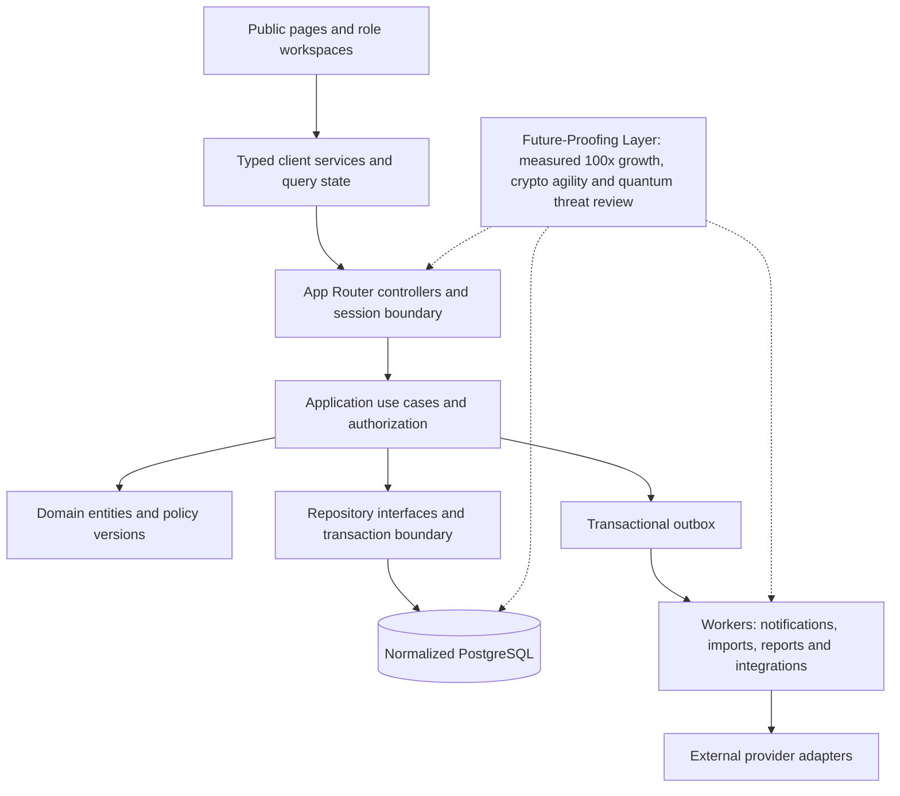

# Nucleus target architecture

Status: implementation design, not a claim of shipped backend behavior. Baseline: local commit d6b3845 plus the subsequent validation corrections. The latest user request authorizes planning the complete service architecture. Existing source evidence and gaps are indexed in this folder.

## Decision and boundaries

Use a modular monolith with clean application/domain/repository boundaries inside the existing Next.js application, plus independently deployed background workers. This provides one transactional database boundary for related HR operations while leaving modules extractable when measured load or ownership warrants it. Do not introduce speculative microkernels, custom cryptography or distributed transactions into ordinary HR workflows.

App Router handlers are transport controllers: authenticate, parse bounded inputs, invoke one use case and serialize a versioned DTO. They contain no payroll formulas or SQL. Application services orchestrate authorization, repositories, domain policies, transactions and events. Domain modules contain pure rules and explicit state machines. Repositories own SQL and return domain records, never driver results to React. Browser services handle HTTP transport, cancellation and error mapping; UI components never query the database directly.



## Folder ownership and migration destination

Keep current routes and navigation IDs compatible. Introduce domain separation incrementally, avoiding a disruptive all-at-once move.

```text
src/
  app/                         HTTP entrypoints and page composition
  components/                  Public shell, forms, feature presentation
  context/                     Identity and appearance; no durable business store
  data/                        Versioned preview fixtures and design tokens
  hooks/                       Query lifecycle and interaction hooks
  services/                    Typed browser clients and provider selection
  lib/                         Shared contracts, money/date types, configuration
  server/
    platform/                  Session, AccessContext, transaction and error helpers
    <domain>/
      application/             Commands and queries, one use case per operation
      domain/                  Entities, state transitions and pure policies
      ports/                   Repository and external provider interfaces
      infrastructure/          PostgreSQL repositories and external adapters
    jobs/                      Outbox dispatch and retryable workers
  utils/                       Pure display helpers
```

Existing `src/server/<domain>/service.ts` files remain compatibility facades during extraction. Move one tested use case at a time. Prohibit cross-domain repository imports: use application ports or domain events. Shared identity keys and small immutable value objects may cross boundaries; salary, medical, bank and candidate details must not leak through generic employee DTOs.

## Identity, tenancy and roles

AccessContext is derived on the server from a verified session: actor, tenant, membership, scoped grants, employee relationship and request ID. Ignore client-supplied role/tenant claims. Every command and query must enforce permission AND record scope. Database tenant foreign keys and non-owner RLS provide a second boundary. Connection pools must establish transaction-local context and never retain another request's tenant state.

Employee: own permitted data and self-service requests. Manager: current effective-dated reporting scope, excluding payroll administration. HR Manager: authorized legal entities and HR operations. Admin: tenant configuration without automatic payroll/PII grants. Superadmin: platform configuration; personnel access requires explicit, expiring, audited support elevation. Do not interpret the preview's broad Superadmin navigation as a production PII grant.

Deny unknown permission keys, stale memberships, inactive employment and unapproved delegations. Approval delegation must be effective-dated, resource-scoped and recorded with both actor and original approver. Prevent self-approval where policy requires independent review.

## Database ownership and normalization

Tenant owns legal entities, establishments, organization units and memberships. Person is separate from employment; assignments, reporting relationships, compensation and jurisdiction eligibility are effective-dated. Country, subdivision, currency, locale and time zone are referenced catalogs. Money uses integer minor units plus currency; use reviewed currency exponents rather than assuming two decimals globally. Dates without times remain calendar dates; punches store instants and establishment time-zone context.

Each domain owns explicit tables listed in DOMAIN_SERVICES.md. The existing 304-table logical model and generic JSON attribute tables are evidence to migrate, not proof of normalization. Decompose searchable business attributes, repeating groups and relationships into constrained columns/tables. JSON is reserved for immutable external payload evidence, non-queryable event snapshots and versioned presentation preferences where justified.

Composite tenant/entity foreign keys prevent cross-tenant relationships. Unique constraints cover business identifiers within the correct tenant/legal entity. Effective-dated records reject overlapping active ranges. Immutable ledgers represent balances and reversals; never silently overwrite a finalized payroll or leave transaction. Retention deletion must respect jurisdictional holds and record dependent-data treatment.

## Runtime and operational design

Short interactive commands finish within a bounded request transaction. Payroll calculations, bulk exports, report generation and integration syncs return a job ID, progress and cancellation policy. Commit outbox events with the mutation; workers deduplicate by event ID and destination. Failed jobs enter a visible retry/dead-letter queue with redacted error details. A retry cannot create a second payment or second leave deduction.

Planning load envelope: 100 tenants × 1,000 active employees initially; test a 100x record-growth scenario before selecting partitioning or read replicas. These are test assumptions, not measured capacity claims. Set initial SLO targets at p95 <500ms for paginated reads and <1s for ordinary commands under an agreed concurrency profile, excluding external providers. Record query counts, examined rows, lock wait and payload size. Dashboard queries have bounded fan-out and display freshness timestamps.

Use managed secrets, TLS and established cryptographic libraries. The Future-Proofing Layer tracks sensitive-data lifetime, key rotation, algorithm inventory and managed-provider migration options for quantum threats. No claim of post-quantum protection is made. Backups require encrypted storage, restore drills and approved RPO/RTO; proposed starting targets are 15-minute RPO and four-hour RTO pending business approval and recovery tests.

## Deployment and compatibility

Keep the synthetic preview explicitly gated and separate from customer environments. Database mode must fail closed if sessions, database grants or required configurations are absent; never fall back to fixtures after a backend failure. Use expand/backfill/verify/switch/contract migrations. The release process runs migrations once through a privileged job, not on every serverless invocation. Runtime connections use restricted credentials; migration credentials never enter the deployed browser bundle.

Vercel/Netlify HTTP runtimes must not own persistent schedulers or long-running jobs. Select a durable worker/scheduler provider during infrastructure design and validate connection pooling with the actual runtime. Production deployment remains gated on service-level acceptance and restore/security evidence, not just compilation.
